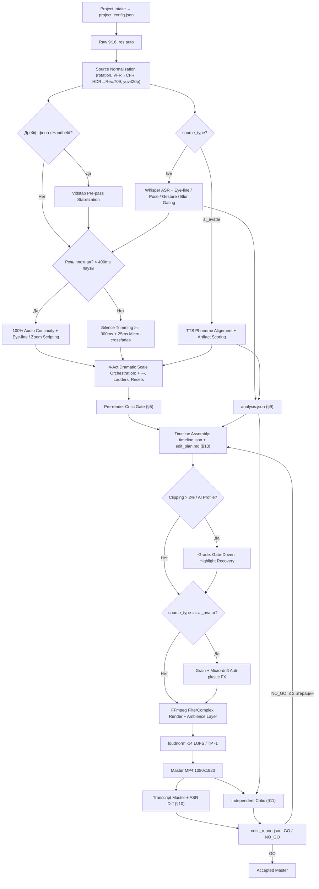

# Talking-Head Jumpcut & Zoom Editor v1.4

Единый профессиональный стандарт и модуль автомонтажа вертикальных экспертных роликов (9:16) в стиле динамичного удержания внимания (talking head retention edit). Модуль содержит **два специализированных профиля**:
1. **Live Mobile Speaker** — для живых, динамичных спикеров с активной мимикой, жестикуляцией, наклонами головы и отводами взгляда.
2. **AI-Avatar Mode** — для синтетических нейросетевых спикеров (HeyGen, Synthesia и др.) с маскировкой артефактов генерации.

Оба профиля используют общую базу калибровки масштабов (1.00x → 1.08x → 1.16–1.18x), 4-актную драматургию (`++--`, лестницы, сбросы), платформенную нормализацию звука (-14 LUFS / TP -1 dBTP) и адаптивные гейты качества.

---

## 0. Startup Intake (Опрос при старте)

При первом запуске (или `--reconfigure`) задаются 6 вопросов с дефолтами (Enter = дефолт); результат сохраняется в `project_config.json`, последующие запуски читают его молча:

```json
{
  "source_type": "auto|live|ai_avatar",
  "subtitles": { "mode": "export_only", "external_tool": "capcut", "format": "srt" },
  "speech_cleanup": { "mode": "strict" },
  "approval": { "edit_plan": "auto" },
  "loop_preference": "auto",
  "language": "ru"
}
```

| # | Вопрос | Дефолт | Зачем |
|---|---|---|---|
| 1 | Тип исходника: live / ai_avatar / auto-detect? | `auto` | Профиль пайплайна |
| 2 | Субтитры: вжигать / export_only? | `export_only` | CapCut/внешний инструмент обычно лучше |
| 3 | Очистка речи: strict (только паузы) / clean_speech (филлеры, фальстарты)? | `strict` | Определяет допустимые удаления |
| 4 | Аппрув edit_plan: auto / human? | `auto` | Пауза перед рендером для ручного ревью |
| 5 | Зацикливание: auto / force / off? | `auto` | Snap-back поведение |
| 6 | Язык ASR? | `ru` | Whisper language hint |

> [!NOTE]
> `subtitles.mode == export_only` → рендер **без** вжигаемых субтитров; скилл отдаёт SRT + word-level JSON с таймкодами **out-мс** (§4) и резервирует `subtitle_safe_zone`; критик проверяет целостность SRT, а не вжигание в кадр.

---

## 1. Архитектура и пайплайн



- **Live Profile:** триггеры склеек и масштабов опираются на **Eye-line классификатор** (`at_camera` / `away`), естественные речевые паузы, фильтрацию смазанных кадров (`blur gate`) и углов наклона головы (`head-pose gate`).
- **AI-Avatar Profile:** таймкоды извлекаются из **TTS phoneme alignment**, точки склеек выставляются на пики **Artifact scoring** (face-embedding $\Delta$, optical flow рук), применяется анти-пластик постобработка.

### 4 артефакта пайплайна (Trust but Verify)

```
analysis.json  →  timeline.json + edit_plan.md  →  master.mp4  →  critic_report.json
 (восприятие)      (решения + человекочитаемый план)   (рендер)     (независимая верификация)
```

- **analysis.json** (§9) — машинный промежуточный документ: всё, что измерено до решений.
- **edit_plan.md** (§13) — человекочитаемая нарратива + машиночитаемый Edit Decision Log для опционального аппрува.
- **critic_report.json** (§11) — результат независимой верификации мастера: GO / NO_GO, замеры, fix_hints.

Двухслойный QC: §5 дёшево ловит ошибки решений **до** рендера (pre-render), §§10–12 дорого но надёжно проверяет результат **после** рендера (post-render).

### Source Normalization (обязательный пре-пасс)

Перед анализом исходник приводится к стандартному виду. Все координаты (`hair_top`, `face_cx`, `bbox`, gesture-зоны) считаются **в координатах normalized/stabilized intermediate**, не исходного контейнера.

| Операция | Условие | Действие |
|---|---|---|
| Rotation | `rotation ≠ 0` в metadata | Физическое применение + `metadata:s:v rotation=0` |
| VFR → CFR | Variable framerate detected | Конвертация в CFR с целевым fps |
| HDR / HLG / Dolby Vision | Non-Rec.709 colorspace | Tonemap в Rec.709 (`zscale` / `tonemap=hable`) |
| Pixel format | `pix_fmt ≠ yuv420p` | Конвертация в `yuv420p` |

JSON-блок в timeline: `source_normalization: { rotation_applied, vfr_to_cfr, target_fps, colorspace: "rec709", hdr_tonemap: "auto_if_needed" }`.

---

## 2. 3-Ступенчатая система планов и геометрия кропа

### Resolution-Aware Scale Cap (Генерализация под разрешение)
При автомонтаже детектируется входное разрешение $H_{in}$ и устанавливается ограничение предельного зума `scale_cap`, исключающее пикселизацию кадра:
- **1080p (1080×1920):** `scale_cap ≈ 1.25x` (планы 1.00x / 1.08x / 1.16x применяются без потерь качества);
- **1440p (1440×2560):** `scale_cap ≈ 1.40x`;
- **4K (2160×3840):** `scale_cap ≈ 1.60x`.

Фактический масштаб сегмента рассчитывается как:
$$scale = \min(\text{scale\_target}, scale\_cap, scale\_for\_face\_target)$$

### Framing Targets (адаптивная крупность по доле лица)

Планы калибруются не только по scale, но и по доле лица в выходе. Крупное лицо в исходнике автоматически понижает план:

| План | Масштаб | `face_h_out_ratio` | Коррекция |
|---|---|---|---|
| План 1 (Context) | 1.00x | 0.26–0.34 | — |
| План 2 (Argument) | 1.08x | 0.31–0.40 | scale понижается если face > 0.40 |
| План 3 (Climax) | 1.16x | 0.38–0.48 | scale понижается до 1.08/1.04 если face > 0.48 |

### Центр кропа и динамический X-центр
Центр кропа по умолчанию центрирован, но при горизонтальном смещении спикера активируется **Dynamic X-center Clamp**:
$$X_{shift} = \text{clamp}(face\_cx - W_{in}/2, -0.04 \cdot W_{in}, 0.04 \cdot W_{in})$$
$$X_{crop} = \text{trunc}\left(\frac{W_{in} - W_{crop}}{2} + X_{shift}\right), \quad Y_{crop} = (H_{in} - H_{crop}) \cdot anchor\_y$$

**X-clamp overflow:** если среднее $|face\_cx - W/2| > 4\%$ на окне $\ge 1.5$s (спикер у края кадра), clamp **не тащит** кроп до упора. На этом отрезке масштаб ограничивается $\le 1.08$x, `X_shift` фиксируется на clamp, причина пишется в log/EDL (`reason: "x_overflow_cap"`).

| План | Масштаб | $anchor\_y$ (fallback) | Допустимые состояния спикера | Что в кадре |
|---|---|---|---|---|
| **План 1 (Широкий / Context)** | **1.00x** | **`0.38`** | Любые: отводы взгляда (`away_breath`), широкие жесты, наклоны головы, показ реквизита | Поясной план, руки, салон авто/студия, 100% естественный воздух |
| **План 2 (Средний / Argument)** | **1.08x–1.10x** | **`0.35`** | Активные жесты перед собой (в нижней/средней зоне), умеренный дрейф позы | Плечи и грудь, жесты перед собой, фокус смещен на логику аргумента |
| **План 3 (Крупный / Climax)** | **1.16x–1.18x** | **`0.28..0.26`** | **Строгие:** `continuous_contact` $\ge 1.5s$, $\|roll\| \le 8^\circ$, $\|pitch\| \le 8^\circ$, руки вне зоны лица / статичны | Крупный портрет, глаза в верхней трети ($y \approx 0.33$), макушка волос НЕ срезается |

> [!IMPORTANT]
> **Segment-Wide Dynamic Headroom Clamp:**
> Мобильный живой спикер активно покачивается и меняет высоту, а синтетический спикер имеет дрейф головы. Измерение по первому кадру приводит к срезанию волос в середине или конце сегмента.
>
> **Обобщенная формула сегментного минимума:**
> Измерять $hair\_top\_src(t)$ по landmarks на протяжении всего сегмента и брать **минимальное значение (наивысшую точку головы)**:
> $$hair\_top\_segment = \min_{t \in [t_{start}, t_{end}]} hair\_top\_src(t)$$
> $$margin\_src = \frac{0.05 \cdot H_{in}}{scale}$$
> *(для 3840p: $192/scale$; для 1920p: $96/scale$ — гарантирует $\ge 5\%$ воздуха над волосами на выходе в каждом кадре).*
> $$Y_{crop} = \min(Y_{default}, hair\_top\_segment - margin\_src)$$
> Константы `0.38` / `0.35` / `0.28` используются только как аварийный fallback.

### Требования к разрешению для Region-crop вставок (Insert-hooks)
Псевдо-вставка реквизита (region-crop) допускается только если ширина вырезаемого бокса $W_{bbox} \ge 0.70 \cdot W_{out}$ (или исходник $\ge 1440\text{p}$). Для исходников 1080p при меньшем bbox — вставка пропускается (`skip`) либо сокращается по длительности ($\le 0.5$s), чтобы избежать заметного апскейл-размытия.

---

## 3. Режиссерские паттерны, семантика событий и драматургия взгляда

Запрещено хаотичное переключение масштабов. Монтаж подчиняется драматургической логике и физике поведения спикера.

### Семантика событий: hard cut vs reframe

Два типа визуальных событий имеют разные правила:

| Тип | Определение | Каденс | Условия |
|---|---|---|---|
| **hard cut** | Стык с удалением footage (jump-cut) | live 2.2–4.5s, AI 2.0–4.0s | Приоритет точек склеек; `at_camera` на границе |
| **reframe** | Мгновенная смена масштаба **без** удаления footage | $\ge 1.8$s от любого события | Свободнее: reframe-down на отводе, шаг «+» на возврате |

**Правило выдоха (переформулированное):** отвод взгляда живёт в 1.00x; reframe-down ставится **только если длительность отвода $\ge 1.0$s** (короткий отвод не трогаем); **hard cut на старте отвода — только по overflow-правилу $> 4.5$s**.

**Anti-flicker:** любые два визуальных события (hard или reframe) $\ge 1.8$s друг от друга. **No-op события** (scale не меняется) запрещены.

В `segments` поле: `"transition_in": "hard" | "reframe"`, `"transition_out": "hard" | "reframe"`.

### Таксономия и параметры Eye-line классификатора
- **Параметры детекции прямого контакта:**
  Кадр классифицируется как `at_camera`, если $|\text{yaw}| \le 10^\circ$ и $|\text{pitch}| \le 10^\circ$ относительно оптической оси камеры. Применяется временной гистерезис $\approx 200$ мс (метка не флипует при микро-движениях глаз).
- **Кадровые метки (Frame-level):** `at_camera` / `away`.
- **Сегментные метки (Segment-level):**
  1. `continuous_contact` — устойчивый зрительный контакт на протяжении всего сегмента (обязателен для плана 3 1.16x $\ge 1.5$s);
  2. `away_breath` — отвод взгляда в сторону/вверх (фаза размышления/«выдоха», удерживается строго в плане **1.00x**);
  3. `away_then_return` — отвод взгляда на старте фразы с возвратом в камеру на ключевом тезисе (склейка на старте в **1.00x**, переход на **1.08x** точно в момент возврата взгляда);
  4. `continuous_then_away` — устойчивый контакт с переходом в отвод внутри сегмента (удерживается в **1.00x**, reframe-down не генерируется если отвод < 1.0s).

### Драматургия взгляда (Eye-line Dramaturgy)
1. **Границы hard cut:** точки разреза ставятся **строго при `at_camera`**. Отвод взгляда не должен оказываться на стыке планов.
2. **Отвод взгляда = «Выдох»:** reframe-down до **1.00x** если отвод $\ge 1.0$s (фаза сброса или `--`).
3. **Возврат взгляда + Тезис = Шаг «+»:** момент возврата взгляда в камеру, совпавший с ключевым словом, является идеальной естественной точкой reframe на **1.08x** или **1.16x**.
4. **План 3 (1.16x) — только на устойчивом контакте:** вход в крупный план разрешен исключительно при `continuous_contact` длительностью $\ge 1.5$ сек. Крупный план на «блуждающих» глазах запрещен.

### Приоритет точек склеек (для hard cut)
$$\text{Возврат взгляда в камеру (Eye-line)} > \text{Естественная пауза (Silence)} > \text{Метрика ритма}$$
*Если из-за поиска точки прямого взгляда интервал между hard cut превышает 4.5 сек, разрешается склейка на самом старте отвода взгляда с принудительным сбросом в 1.00x (контекстный выдох).*

### Управление жестами и энергией
- **Жестовые фрагменты (размахи, экспрессия):** удерживаются в **1.08x** как выражение энергии. Запрещено дробить план склейками внутри развивающегося жеста.
- **Запрет входа на пересечении:** запрещено начинать новый план в кадре, где кисть руки только входит в зону лица. Жест должен либо целиком уместиться в плане, либо остаться вне кадра.

### 6 базовых драматургических паттернов
1. **Лестница нарастания (Escalation Ladder: $1.00x \to 1.08x \to 1.16x$):**
   - Развитие аргумента от примера к кульминационному выводу при устойчивом взгляде в камеру.
2. **Паттерн `++--` (Погружение → Выдох / Wisdom Arc):**
   - $1.00x \text{ (сброс)} \to 1.08x \text{ [+]} \to 1.16x \text{ [++]} \to 1.08x \text{ [-]} \to 1.00x \text{ [--]}$.
   - Идеален для личных историй: кульминация на прямом взгляде, спад/выдох при размышлении и отводе взгляда.
3. **Контекстный сброс (Context Reset to 1.00x):**
   - Возврат на общий план в начале нового смыслового блока или при переключении внимания на окружение.
4. **Бесшовный луп (Snap-back Outro):**
   - Откат на 1.00x на последних 0.5–1.0 сек для зацикливания ролика в ленте.
   - **Условие:** применяется **только если `loop_state_match == true`** (поза, взгляд и реквизит в финале совпадают со стартом). Иначе финал остается на 1.16x (`snap_back: false`).
5. **Insert-hook (псевдо B-roll):**
   - Старт с region-crop кропом реквизита (0.6–1.0s) из широкого кадра с последующим переходом в 1.00x (при $W_{bbox} \ge 0.70 \cdot W_{out}$).
6. **Artifact-mask cut (Jump-cut маскировка для AI):**
   - Принудительная склейка со сменой масштаба точно в локальный максимум artifact-score с принудительным каденсом 2.0–4.0s.

---

## 4. Спецификация JSON-схемы v1.4 (Timeline Manifest)

### Ключевые изменения v1.3 → v1.4

- **`segments` — первичный контракт** (вместо пар cuts+zooms): каждый сегмент содержит `src_ms`, `out_ms`, `dur_ms`, `type`, `scale`, `transition_in/out`.
- `zooms` остаются как производный render-helper с `out_ms`.
- Новые блоки: `source_normalization`, `captions`, `micro_drift`.
- `subtitle_safe_zone` помечен как *informational for downstream*.

```json
{
  "version": "1.4",
  "source": "raw_video_1080p.mp4",
  "source_type": "live",
  "source_res": [1080, 1920],
  "scale_cap": 1.25,
  "subtitle_safe_zone": 0.18,
  "fps": 30,
  "source_normalization": {
    "rotation_applied": false,
    "vfr_to_cfr": false,
    "target_fps": 30,
    "colorspace": "rec709",
    "hdr_tonemap": "none"
  },
  "stabilization": {
    "enabled": false,
    "method": "vidstab",
    "reason": "camera_static"
  },
  "asr": {
    "engine": "whisper",
    "fallback": "tts_alignment"
  },
  "audio": {
    "mode": "original",
    "cut_fade_ms": 25,
    "ambience": {
      "enabled": true,
      "path": "cabin_ambience.mp3",
      "volume": 0.07
    }
  },
  "captions": {
    "mode": "export_only",
    "format": "srt",
    "srt_path": "master_captions.srt",
    "word_timestamps": "master_words.json",
    "note": "Timestamps in out_ms; safe_zone reserved but not burned in"
  },
  "micro_drift": {
    "enabled": "fallback",
    "live": [1.00, 1.03],
    "ai": [1.00, 1.02],
    "use_when": ["no_safe_cut_gt_5s"]
  },
  "inserts": [
    {
      "at_ms": 0,
      "dur_ms": 900,
      "kind": "region_crop",
      "bbox": [270, 880, 760, 420],
      "label": "Хук: реквизит / деталь"
    }
  ],
  "segments": [
    {
      "id": "seg_000",
      "type": "insert",
      "src_ms": [0, 900],
      "out_ms": [0, 900],
      "dur_ms": 900,
      "scale": 1.00,
      "transition_in": "hard",
      "transition_out": "reframe",
      "gaze_segment": "at_camera",
      "label": "Хук: region-crop реквизита"
    },
    {
      "id": "seg_001",
      "type": "keep",
      "src_ms": [900, 5200],
      "out_ms": [900, 5200],
      "dur_ms": 4300,
      "scale": 1.00,
      "transition_in": "reframe",
      "transition_out": "reframe",
      "gaze_segment": "continuous_then_away",
      "head_pose": { "roll_deg": 2.1, "pitch_deg": -1.4 },
      "blur_score_ok": true,
      "gesture_state": "hands_down",
      "eyes_open": true,
      "label": "Тезис; отвод взгляда живёт в 1.00x (выдох без события)"
    },
    {
      "id": "seg_002",
      "type": "keep",
      "src_ms": [5200, 7500],
      "out_ms": [5200, 7500],
      "dur_ms": 2300,
      "scale": 1.08,
      "transition_in": "reframe",
      "transition_out": "hard",
      "gaze_segment": "continuous_contact",
      "head_pose": { "roll_deg": 1.5, "pitch_deg": -0.8 },
      "blur_score_ok": true,
      "gesture_state": "active_gesturing",
      "eyes_open": true,
      "label": "Возврат взгляда + аргумент (+)"
    },
    {
      "id": "seg_003",
      "type": "keep",
      "src_ms": [7800, 10100],
      "out_ms": [7500, 9800],
      "dur_ms": 2300,
      "scale": 1.16,
      "transition_in": "hard",
      "transition_out": "hard",
      "gaze_segment": "continuous_contact",
      "head_pose": { "roll_deg": 0.8, "pitch_deg": -0.5 },
      "blur_score_ok": true,
      "gesture_state": "hands_down",
      "eyes_open": true,
      "label": "Панчлайн (++); hard cut вырезал паузу 300ms"
    }
  ],
  "zooms": [
    { "out_ms": 0, "scale": 1.00, "anchor": "dynamic_segment_min", "headroom_out_px": 96 },
    { "out_ms": 5200, "scale": 1.08, "anchor": "dynamic_segment_min", "headroom_out_px": 96 },
    { "out_ms": 7500, "scale": 1.16, "anchor": "dynamic_segment_min", "headroom_out_px": 96 }
  ],
  "video_fx": {
    "grain_opacity": 0.0,
    "drift": [1.00, 1.00],
    "grade": {
      "highlight_recovery": false
    }
  },
  "loudness": {
    "target_lufs": -14.0,
    "true_peak_dbtp": -1.0,
    "ambience_lowpass_hz": 9000
  },
  "loop": {
    "snap_back": false,
    "reason": "prop_state_mismatch"
  },
  "log": [
    "[00:00:00.000] INSERT reframe | 1.00x Region crop hook (900ms)",
    "[00:00:00.900] KEEP reframe | 1.00x Тезис + отвод взгляда (выдох без события)",
    "[00:00:05.200] KEEP reframe | 1.08x Возврат взгляда + аргумент (+)",
    "[00:00:07.500] KEEP hard | 1.16x Панчлайн (++); hard cut вырезал паузу 300ms"
  ]
}
```

> [!NOTE]
> Интервалы событий в примере: 4.3s / 2.3s / 2.3s — проходят ритм-гейт и anti-flicker. No-op событий нет (3900ms no-op убран — отвод взгляда живёт внутри seg_001 в 1.00x). Пример демонстрирует `src_ms ≠ out_ms` (hard cut с удалением паузы) и семантику `hard` / `reframe`.

---

## 5. Pre-render Critic Gate & Валидация манифеста

Перед рендером манифест (`timeline.json`) валидируется по гейтам. Это **дешёвый ранний фильтр** — ловит ошибки решений до дорогостоящего рендера. Post-render верификация результата — в §§10–12.

### Универсальные гейты (Universal Gates)
- [ ] **ASR & Alignment:** стенограмма на 100% сохраняет смысл и слова (0% случайно отрезанных окончаний слов/слогов).
- [ ] **Ритм зумов (Rhythm Gate):**
  - Каденс **hard cut**: live 2.2–4.5s, AI 2.0–4.0s;
  - Каденс **reframe**: $\ge 1.8$s от любого визуального события; reframe-down только при отводе $\ge 1.0$s;
  - **No-op запрещены:** каждое событие меняет scale.
- [ ] **Segment-Wide Headroom:** $hair\_top$ рассчитан как $\min$ по всему сегменту; воздух над волосами на выходе строго $\ge 5\%$ ($margin\_src = 0.05 \cdot H_{in} / scale$).
- [ ] **Framing Targets:** `face_h_out_ratio` в допустимом диапазоне для плана (plan1: 0.26–0.34, plan2: 0.31–0.40, plan3: 0.38–0.48).
- [ ] **X-clamp overflow:** при среднем $|face\_cx - W/2| > 4\%$ на окне $\ge 1.5$s — масштаб $\le 1.08$x, причина в EDL.
- [ ] **Loudness chain:** цепочка loudnorm **присутствует в filtergraph** (числовые значения измеряются только post-render §12 F).
- [ ] **Gate-Driven Highlight Recovery:** замер пересветов; если клиппинг в зоне света/окон $> 2\%$, цветокоррекция с highlight recovery активируется.
- [ ] **Blink-gate:** на первом и последнем кадре каждого сегмента глаза открыты; склейка отстоит не ближе $\pm 150$ мс от момента моргания.
- [ ] **Loop state check:** откат `snap_back` активируется только при совпадении состояния позы/реквизита старта и финала (`loop_state_match == true`).
- [ ] **FFmpeg SAR & Even Dimensions Integrity:** во всех цепочках фильтра указаны `setsar=1` и четные размеры `trunc(iw/scale/2)*2`.
- [ ] **Source Normalization:** rotation/CFR/Rec.709 применены в filtergraph.
- [ ] **Clean Speech rule** (при `speech_cleanup: clean_speech`): удалены только события с label `filler` / `false_start` / `long_pause`; все удаления отражены в EDL.

### Гейты живого мобильного спикера (Live Mobile Speaker Gates)
- [ ] **Eye-line gate:** границы hard cut строго при `at_camera`; склейка не попадает на момент отвода взгляда; крупный план (1.16x) назначен только на отрезок с `continuous_contact` $\ge 1.5$ сек.
- [ ] **Head-pose gate:** при $\|roll\| > 8^\circ$ или $\|pitch\| > 8^\circ$ вход в план 3 (1.16x) заблокирован (план понижается до 1.00x или 1.08x).
- [ ] **Gesture gate:** при наличии рук в верхней половине кадра план $\le 1.08x$; запрещен старт плана в момент входа кисти в зону лица.
- [ ] **Blur gate:** на границе $\pm 3$ кадра резкость по Laplacian Variance выше пороговой (смазанные кадры смещают границу склейки).
- [ ] **Vidstab check:** при наличии фонового дрейфа камеры (handheld) выполнен пре-пасс стабилизации до расчета кропов.

### Гейты синтетического аватара (AI-Avatar Gates)
- [ ] **Cut-artifact alignment:** каждая склейка выставлена в окно $\pm 100$ мс от локального пика artifact-score.
- [ ] **Forced cadence check:** принудительный каденс склеек строго **2.0–4.0 сек** (защита от зависаний без маскировки артефактов).
- [ ] **Accessory & Hand integrity:** дефекты морфинга пальцев и аксессуаров изолированы планом $\le 1.00x$, подрезкой или отправлены на регенерацию ($>1.5s$).
- [ ] **De-plastic FX check:** наложено зерно $\approx 0.05$, микро-дрифт 1.00→1.02.

### Conflict Resolution Policy (иерархия при конфликте гейтов)

Когда несколько гейтов конфликтуют, применяется строгий приоритет:

1. **Speech integrity** — нельзя терять слова (абсолютный приоритет).
2. **Hard visual defects** — blink/blur на границе, срез головы, исчезновение реквизита.
3. **Eye-line** — `at_camera` на границах hard cut.
4. **Gesture integrity** — не дробить развивающийся жест.
5. **Downgrade плана** — 3→1.08→1.00 (каскадное понижение).
6. **Micro-drift fallback** — если интервал $> 5$s и нет безопасной точки склейки: micro-drift 1.00→1.03 (live) вместо hard cut.
7. **Эскалация** — после 2 итераций NO_GO → эскалация человеку.

---

## 6. Профиль «Live Mobile Speaker» (Специфика мобильного спикера)

1. **Монтаж от зрительного контакта:**
   Склейка — это приглашение к диалогу. Возврат взгляда в камеру трактуется как импульс внимания и служит главным триггером перехода к аргументу (1.08x) или кульминации (1.16x). Отвод взгляда — естественный повод для выдоха в 1.00x.
2. **Защита от завала геометрии при наклонах:**
   Наклоны головы в плане 3 создают ощущение, что спикер «вываливается» из экрана. Порог наклона $\|roll\|/\|pitch\| \le 8^\circ$ надежно защищает крупный план.
3. **Сохранение целостности жестикуляции:**
   Живая жестикуляция — это ценная органика, а не брак. Жесты удерживаются в умеренном плане 1.08x без дробления внутри фазы движения.
4. **Фильтрация смазанных кадров:**
   Резкие движения головой порождают motion blur. Склейка на размытом кадре ощущается как технический глитч. Blur gate автоматически сдвигает рез на соседний резкий кадр.
5. **Пре-пасс стабилизации (Vidstab):**
   Если камера не зафиксирована на штативе (дрейф оператора), зумирование многократно усиливает тряску. Включается пре-пасс `vidstabdetect` / `vidstabtransform` до применения матрицы зумов.
6. **Micro-drift (fallback only):**
   Разрешён **только** как fallback при невозможности безопасного hard cut при интервале $> 5$s (§5, Conflict Resolution п.6). Диапазон: 1.00→1.03. Не является постоянным визуальным эффектом.

---

## 7. Профиль «AI-Avatar Mode» (Специфика синтетических спикеров)

1. **Резки по артефактам вместо пауз:**
   Silence-trimming отключен (TTS генерирует плотную речь). Склейки маскируют всплески артефактов генератора с каденсом 2.0–4.0s.
2. **Порог регенерации:**
   Если artifact-score превышает допустимый порог непрерывно $> 1.5$ сек — фрагмент отправляется на повторную генерацию в нейросети.
3. **Region-Crop B-roll:**
   Псевдо-перебивки из исходника без затрат на внешнюю генерацию (при $W_{bbox} \ge 0.70 \cdot W_{out}$).
4. **Анти-пластик цепочка:**
   Зерно (`grain_opacity ~ 0.05`), микро-дрифт (`1.00 → 1.02`, обязательный постоянный эффект), highlight recovery.
5. **Аудио-контур:**
   Фонемный alignment из TTS, нормализация `-14.0 LUFS` / `TP -1 dBTP`, low-pass фильтр интершума $\sim 9\text{ кГц}$ (только для подмешиваемого эмбиенса).

---

## 8. Сводная матрица профилей

| Параметр / Гейт | Live Mobile Speaker | AI-Avatar Mode |
|---|---|---|
| **Главный триггер резов** | Возврат взгляда в камеру (`at_camera`) + паузы речи | Пики метрики артефактов генерации (Artifact score) |
| **ASR & Таймкоды** | Whisper Word-Level ASR | TTS Phoneme Alignment (Whisper — fallback) |
| **Silence Trimming** | Активен ($\ge 300$ мс, 25 мс кроссфейды) | Отключен (речь изначально плотная) |
| **Headroom Clamp** | $\min$ по всему сегменту ($hair\_top\_segment$) | Динамический по landmarks с защитой от дрейфа |
| **Ограничения Плана 3** | `continuous_contact` $\ge 1.5s$, наклоны $\le 8^\circ$, руки вне зоны лица | Отсутствие дефектов аксессуаров/лица |
| **Жестикуляция** | Удержание в плане 1.08x как визуальной энергии | План $\le 1.00x$ при дефектах пальцев / подрезка |
| **Motion Blur / Смаз** | Blur gate (сдвиг склейки на резкий кадр) | Не актуален (синтетический рендер) |
| **Micro-drift** | Fallback only (1.00→1.03) при $> 5$s без safe cut | Обязательный (1.00→1.02), постоянный |
| **Постобработка кадра** | Нативное зерно; Gate-driven Highlight Recovery (при клиппинге $>2\%$) | Зерно ~0.05, микро-дрифт 1.00→1.02, обязательный Highlight Recovery |
| **Интершум & Loudness** | Мастеринг **`-14.0 LUFS` / `TP -1 dBTP`** (исходный звук + петля эмбиенса) | Мастеринг **`-14.0 LUFS` / `TP -1 dBTP`** (Low-pass интершума ~9 кГц) |
| **Субтитры** | export_only (SRT + word JSON по out-мс) | export_only (SRT + word JSON по out-мс) |

---

### Приоритет применения правил (Execution Order)

1. **Project Intake (§0)** — чтение/создание `project_config.json`.
2. **Source Normalization** — rotation, VFR→CFR, HDR→Rec.709, yuv420p.
3. **Resolution Scale Cap & Segment-Wide Headroom** — расчет предельного зума и общего минимума высоты волос по всему сегменту ($margin\_src = 0.05 \cdot H_{in}/scale$).
4. **Perception & Measurement → analysis.json (§9)** — ASR, eye-line, pose, gesture, blur, blink, face\_track, cut\_candidates, artifact\_score, speech\_events.
5. **Eye-line / Artifact Alignment** — выбор точек склеек (hard/reframe) по контакту взгляда (live) или пикам дефектов (AI).
6. **Blink, Blur & Pose Gates** — очистка стыков от морганий, смазанных кадров и критических наклонов головы.
7. **Gesture & Scale Assignment** — фиксация 1.08x на жестах, допуск к 1.16x только при `continuous_contact` $\ge 1.5$s; framing targets по `face_h_out_ratio`.
8. **Inserts & Loop State Match** — генерация region-crop хуков (при $W_{bbox} \ge 0.70 \cdot W_{out}$) и проверка условий для snap-back.
9. **Pre-render Critic Gate (§5)** — валидация манифеста + conflict resolution policy.
10. **De-plastic FX & Loudness Mastering** — грейдинг пересветов при клиппинге $>2\%$ и нормализация звука до -14 LUFS / TP -1 dBTP.
11. **Render → Master.**
12. **Post-render: Double Transcription (§10) → Independent Critic (§11) → Master QC (§12)** — верификация результата. NO_GO → авто-фикс → повторный рендер (≤ 2 итераций, далее эскалация).
13. **Captions Export** — SRT + word-level JSON с out-мс таймкодами (при `captions.mode == export_only`).

---

## 9. Промежуточный артефакт: analysis.json

Машинный документ восприятия — всё, что измерено до принятия монтажных решений. Является входом для Timeline Assembly и для Independent Critic (§11). Все координаты в пространстве normalized/stabilized intermediate.

```json
{
  "source_meta": {
    "resolution": [1080, 1920],
    "fps": 30,
    "scale_cap": 1.25,
    "handheld_drift": false,
    "normalization": { "rotation_applied": false, "vfr_to_cfr": false, "colorspace": "rec709" }
  },
  "asr_reference": {
    "engine": "whisper",
    "words": [{ "w": "...", "start_ms": 0, "end_ms": 240 }],
    "full_text": "..."
  },
  "speech_events": [
    { "src_ms": [2400, 2750], "type": "long_pause", "text": "" },
    { "src_ms": [8100, 8350], "type": "filler", "text": "эээ" }
  ],
  "pauses": [
    { "start_ms": 2400, "end_ms": 2750, "dur_ms": 350 }
  ],
  "gaze_intervals": [
    { "start_ms": 0, "end_ms": 3900, "label": "at_camera" },
    { "start_ms": 3900, "end_ms": 5200, "label": "away" }
  ],
  "blinks": [
    { "t_ms": 1200, "dur_ms": 120 }
  ],
  "pose_intervals": [
    { "start_ms": 0, "end_ms": 7200, "roll_deg": 2.1, "pitch_deg": -1.4 }
  ],
  "blur_intervals": [
    { "start_ms": 6800, "end_ms": 6900, "laplacian_var": 42.0 }
  ],
  "gesture_intervals": [
    { "start_ms": 5200, "end_ms": 7200, "state": "active_gesturing" }
  ],
  "face_track": [
    { "t_ms": 0, "hair_top": 480, "face_cx": 540, "face_h": 600 }
  ],
  "background_patches": [
    { "bbox": [0, 0, 200, 200], "descriptor": "leaf_edge_top_left" }
  ],
  "artifact_score": [],
  "cut_candidates": [
    { "ms": 3900, "score": 0.9, "reason": "eye_return" },
    { "ms": 5200, "score": 0.85, "reason": "pause" }
  ],
  "insert_candidates": [
    { "bbox": [270, 880, 760, 420], "quality": 0.8 }
  ]
}
```

> [!NOTE]
> - `artifact_score` заполняется только для `source_type == "ai_avatar"`. Для `live` массив остается пустым.
> - `speech_events` — единственное, что разрешено удалять в режиме `clean_speech` (филлеры, фальстарты, длинные паузы). Все удаления отражаются в EDL (§13).
> - `background_patches` — статичные фоновые участки для верификации зумов критиком (§11).

---

## 10. Двойная транскрипция (Post-render: контур целостности речи)

Гарантирует, что рендер не потерял, не обрезал и не исказил ни одного слова.

1. **Начало (до рендера):** word-level транскрипция raw → `asr_reference` (фиксируется в `analysis.json`).
   - Для AI-аватара: TTS-скрипт — ground truth; Whisper — сверка.
2. **Конец (после рендера):** транскрипция **мастера** → `asr_master`.
3. **Diff-протокол:**
   - Нормализация: нижний регистр, без пунктуации, коллапс пробелов.
   - Три сравнения:
     - `asr_master` vs **expected** (конкатенация слов из `asr_reference`, попавших в `keep` сегменты timeline с учётом `speech_events` удалений) → ловит ошибки рендера/фейдов;
     - `expected` vs `asr_reference` → ловит ошибки самого таймлайна (случайно отрезанные слова);
     - Допуски: **0 удалений, 0 замен, 0 вставок** слов.
   - Расхождение = **NO_GO**.
4. **Человекочитаемый отчет:** `transcript_side_by_side.txt` прикладывается к `critic_report.json` для ручного аппрува.

> [!IMPORTANT]
> Мелкие расхождения Whisper (переинтерпретация падежей, «катастрофа» vs «катастрофой») — это артефакты ASR, а не ошибки монтажа. Нормализация и fuzzy-match на уровне лемм допускает такие вариации. Фатальные ошибки: пропущенные слова, вставленные чужие слова, обрезанные слоги.

---

## 11. Независимый критик (Post-render: просмотр и замеры)

**Контракт независимости:** критик получает `master.mp4`, `analysis.json` и `asr_reference`. `timeline.json` — только для сверки «что хотели» vs «что получилось», не как источник истины.

### Протокол просмотра

1. **Контакт-лист:** сетка 4×4 из первых/последних кадров каждого сегмента + кадры границ → визуальный проход (LLM-vision или человек):
   - headroom (воздух над волосами);
   - открытые глаза на границах;
   - резкость кадра;
   - eye-line на границах (`at_camera` для live);
   - целостность жеста/реквизита.

2. **Замеры по мастеру:**
   - **Геометрия:** ffprobe (1080×1920, SAR 1:1, четность); `hair_top_out` $\ge 5\%$ на выборке 5 fps внутри сегментов; `face_cx` $\le \pm 4\%$;
   - **Факт зумов (по статичному фону):** template-matching фоновых патчей из `analysis.json.background_patches` (кромки листьев, стена, интерьер); scale = отношение размеров matched-патчей ($\pm 1.5\%$) + времена переключений $\pm 2$ кадра. `face_h` — вспомогательная метрика: расхождение face_h и background-scale $> 3\%$ трактуется как «субъект двинулся к камере», а не ошибка рендера;
   - **Ритм:** фактические интервалы в диапазоне профиля, нет статики $> 5$s;
   - **Аудио:** ebur128 → $I = -14 \pm 0.5$ LUFS, $TP \le -1$ dBTP; клики на стыках;
   - **FX профиля:** клиппинг $\le 2\%$; grain/drift только у AI;
   - **Captions (при `export_only`):** SRT существует; таймкоды в out-мс; текст = asr_master; карточки 700–2200 мс; не ближе 120 мс к hard cut.

3. **Выход:** `critic_report.json`:

```json
{
  "verdict": "NO_GO",
  "iteration": 1,
  "checks": [
    { "id": "ASR_DIFF", "status": "pass", "measured": "0 deletions" },
    { "id": "HEADROOM", "status": "fail", "segment_ms": [3900, 7200], "measured_px": 88, "required_px": 96 },
    { "id": "CONTAINER", "status": "pass", "measured": "1080x1920 SAR=1:1 yuv420p Rec.709" },
    { "id": "ZOOM_RATIO", "status": "pass", "measured": "1.08x ±0.8% (bg-match)" },
    { "id": "RHYTHM", "status": "pass", "measured": "2.3-4.1s range" },
    { "id": "LOUDNESS", "status": "pass", "measured": "-14.1 LUFS, TP=-1.8 dBTP" },
    { "id": "FX", "status": "pass", "measured": "clipping 0.3%" },
    { "id": "CAPTIONS_SRT", "status": "pass", "measured": "42 cards, timing OK" },
    { "id": "SYNC", "status": "pass", "measured": "drift <1 frame" },
    { "id": "COLORSPACE", "status": "pass", "measured": "Rec.709, no HDR metadata" }
  ],
  "fix_hints": [
    "сегмент 3900-7200: anchor_y += дельта / взять min hair_top"
  ],
  "transcript_side_by_side": "transcript_side_by_side.txt"
}
```

4. **Цикл исправлений:** NO_GO → авто-фикс timeline по `fix_hints` → повторный рендер → повторный критик; **максимум 2 итерации**, далее эскалация человеку.

> [!WARNING]
> Критик замеряет **мастер**, а не манифест. Если ffmpeg молча проигнорировал фильтр (SAR, crop dimensions, loudnorm), pre-render валидация (§5) это не поймает — поймает только post-render критик.

---

## 12. Чек-лист приемки мастера (Master QC)

Все пункты измеряются **на мастере**, не по манифесту. Это финальный acceptance gate.

**A. Целостность речи** — ASR-diff (§10): 0 удалений/замен/вставок слов; `transcript_side_by_side.txt` идентичен без пауз.

**B. Контейнер & Цвет** — 1080×1920, SAR 1:1, четные размеры, fps совпадает с исходником; Rec.709, отсутствие HDR metadata в SDR-экспорте; rotation применена физически; CFR; PTS монотонные.

**C. Геометрия** — headroom $\ge 5\%$ во всех сегментах; `face_cx` $\le \pm 4\%$ $W_{in}$; план 3: $|roll/pitch| \le 8°$ и `at_camera` $\ge 1.5$s внутри сегмента; `face_h_out_ratio` в допуске для плана.

**D. Границы** — глаза открыты в первом/последнем кадре каждого сегмента; $\ge 150$ мс от моргания; резкие кадры (blur gate); hard cut на `at_camera` (live) / на пике артефактов (AI); реквизит не исчезает в том же плане.

**E. Ритм** — фактические переключения = timeline $\pm 2$ кадра; интервалы в диапазоне профиля (hard: live 2.2–4.5s, AI 2.0–4.0s; reframe $\ge 1.8$s); нет статики $> 5$s и мельтешения $< 1.8$s; no-op отсутствуют; snap\_back только при `loop_state_match`.

**F. Аудио** — $-14 \pm 0.5$ LUFS, $TP \le -1$ dBTP; 25 мс фейды на стыках; интершум по профилю.

**G. Sync** — audio/video drift $\le 1$ кадр на весь ролик; нет duplicate/drop frames на hard cuts.

**H. FX** — AI: grain $\approx 0.05$, drift 1.00→1.02, клиппинг $\le 2\%$; live: без grain/drift, если не сработал клиппинг-гейт; micro-drift — только fallback.

**I. Captions export** — SRT существует; целостен с `asr_master`; таймкоды out-мс; карточки 700–2200 мс; $\ge 120$ мс от hard cut.

**J. Вердикт критика** — `critic_report.verdict == "GO"`.

> [!CAUTION]
> Если после 2 итераций NO_GO остаётся — эскалация человеку с `critic_report.json` и `transcript_side_by_side.txt`. Автоматический цикл прекращается.

---

## 13. Edit Decision Log (расширение edit_plan.md)

Каждое монтажное решение в `edit_plan.md` содержит машиночитаемый блок:

```
segment: seg_002
src_ms: [5200, 7500] → out_ms: [5200, 7500]
type: keep
scale: 1.08
transition_in: reframe | transition_out: hard
reason: eye_return (возврат взгляда в камеру на ms=5200)
gates_passed: [eye_line, blink, blur, pose, gesture, headroom, rhythm, framing]
speech_impact: none
```

Для `clean_speech` режима с удалениями:

```
segment: seg_003
src_ms: [7800, 10100] → out_ms: [7500, 9800]
type: keep
scale: 1.16
transition_in: hard | transition_out: hard
reason: pause (удалена пауза 300ms на 7500-7800ms)
gates_passed: [eye_line, blink, blur, pose, headroom, rhythm, framing]
speech_impact: removed long_pause at src_ms=[7500,7800] (300ms silence)
```

Используется:
- Человеком при `approval.edit_plan == "human"` — для ручного ревью перед рендером;
- Критиком (§11) — для объяснимости NO_GO и верификации gate compliance.
