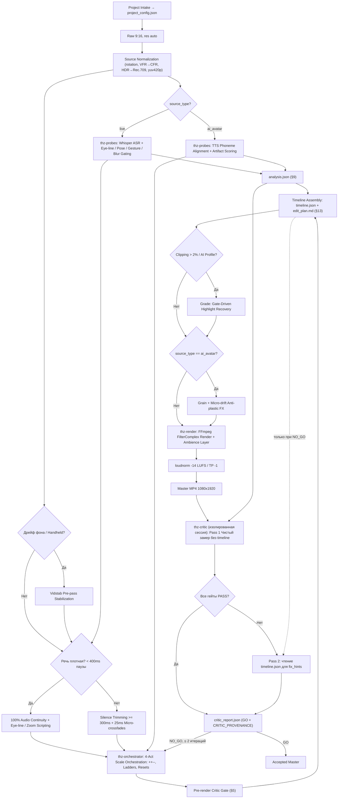

# Talking-Head Jumpcut & Zoom Editor v1.6.2

Единый профессиональный стандарт и модуль автомонтажа вертикальных экспертных роликов (9:16) в стиле динамичного удержания внимания (talking head retention edit). Модуль содержит **два специализированных профиля**:
1. **Live Mobile Speaker** — для живых, динамичных спикеров с активной мимикой, жестикуляцией, наклонами головы и отводами взгляда.
2. **AI-Avatar Mode** — для синтетических нейросетевых спикеров (HeyGen, Synthesia и др.) с маскировкой артефактов генерации.

Оба профиля используют общую базу калибровки масштабов (1.00x → 1.08x → 1.16–1.18x), 4-актную драматургию (`++--`, лестницы, сбросы), платформенную нормализацию звука (-14 LUFS / TP -1 dBTP) и адаптивные гейты качества.

---

## 0. Startup Intake (Опрос при старте)

При первом запуске (или `--reconfigure`) задаются 8 вопросов с дефолтами (Enter = дефолт); результат сохраняется в `project_config.json`, последующие запуски читают его молча:

```json
{
  "source_type": "auto|live|ai_avatar",
  "profile": "premium-calm|neutral|dynamic|custom",
  "content": { "pace": "auto|calm|neutral|high" },
  "zoom": { "intensity": "auto|calm|moderate|dynamic" },
  "subtitles": { "mode": "off|export_only", "format": "srt|srt_and_json", "external_tool": "capcut" },
  "source_captions": "auto|none|burned_keep|burned_remove",
  "semantic": { "keywords": [] },
  "grade": { "look": "none|soft_warm|neutral_cool|natural", "vignette": false },
  "speech_cleanup": { "mode": "strict" },
  "approval": { "edit_plan": "auto" },
  "loop_preference": "auto",
  "language": "ru",
  "output": { "naming_pattern": "{date}_{slug}_v{ver}_{res}", "artifacts_retention": "minimal|full" },
  "overrides_log": []
}
```

| # | Вопрос | Дефолт | Зачем |
|---|---|---|---|
| 1 | Тип исходника: live / ai_avatar / auto-detect? | `auto` | Профиль пайплайна |
| 2 | Субтитры: вжигать / export_only? | `export_only` | CapCut/внешний инструмент обычно лучше |
| 3 | Очистка речи: strict (только паузы) / clean_speech (филлеры, фальстарты)? | `strict` | Определяет допустимые удаления |
| 4 | Аппрув edit_plan: auto / human? | `auto` | Пауза перед рендером для ручного ревью |
| 5 | Зацикливание: auto / force / off? | `auto` | Snap-back поведение |
| 6 | Язык ASR? | `ru` | Whisper language hint |
| 7 | Profile (pace/style): premium-calm / neutral / dynamic / custom? | `neutral` | expands into pace + zoom.intensity + grade.look + hook_pref (см. Приложение B) |
| 8 | Files: naming pattern + retention + subtitles off? | `{date}_{slug}_v{ver}_{res}` / `minimal` / `export_only` | Настройка выходных файлов |

**Правило валидации [v1.5]:** если `pace=calm` + `intensity=dynamic` → генерируется warning, происходит auto-resolve `intensity` → `moderate`, изменение логируется в `project_config.json#overrides_log`.

Формат `overrides_log`:
```json
[
  {
    "timestamp": "2026-01-15T14:32:00Z",
    "conflict": "pace=calm + intensity=dynamic",
    "resolution": "intensity → moderate",
    "reason": "incompatible combination"
  }
]
```

> [!NOTE]
> `subtitles.mode == export_only` → рендер **без** вжигаемых субтитров; скилл отдаёт SRT + word-level JSON с таймкодами **out-мс** (§4) и резервирует `subtitle_safe_zone`; критик проверяет целостность SRT, а не вжигание в кадр.
> При `subtitles.mode == off` → word-level ASR остаётся внутренним (нужен для ASR-diff §10); внешние SRT/JSON не генерируются; `subtitle_safe_zone` всё ещё резервируется.

---

## 1. Архитектура и пайплайн



### Разделение исполнения на 4 изолированных контура [v1.6.1 Architecture]

Чтобы исключить execution gap (когда рендерер/оркестратор сам себя аттестует по манифесту), канон остаётся единым, а исполнение разделяется на 4 изолированных модуля с жёстким ограничением provenance:

1. **`thz-probes` (CV-анализ):** facemesh/EAR, gaze, pose, blur, background patches, source_captions, pace_features $\to$ `analysis.json`.
2. **`thz-orchestrator` (Режиссура):** акты, паттерны, хук, калибровка лестницы, starvation-лесенка $\to$ `timeline.json + edit_plan.md`.
3. **`thz-render` (Рендерер):** ffmpeg filtergraph, source normalization, grade, loudness, mux $\to$ `master.mp4`.
4. **`thz-critic` (Изолированный критик):** отдельная сессия/скрипт; на вход подаются **исключительно** `master.mp4 + analysis.json + asr_reference`. Манифест `timeline.json` используется **только во 2-м проходе** после обнаружения дефектов для выработки `fix_hints`.

> [!CAUTION]
> **[v1.6.1] PROCESS_INTEGRITY Guard:**
> Узел `critic_report.json` производится **исключительно** скриптом `thz-critic`. Запись или генерация отчёта оркестратором/рендерером является нарушением `PROCESS_INTEGRITY` и влечёт немедленный процессный **NO_GO** с эскалацией человеку. Пайплайн не публикует мастер без валидного отчёта с подтверждённым `master_sha256` и `script_sha256`.

### Source Normalization (обязательный пре-пасс)

Перед анализом исходник приводится к стандартному виду. Все координаты (`hair_top`, `face_cx`, `bbox`, gesture-зоны) считаются **в координатах normalized/stabilized intermediate**, не исходного контейнера.

| Операция | Условие | Действие |
|---|---|---|
| Rotation | `rotation ≠ 0` в metadata | Физическое применение + `metadata:s:v rotation=0` |
| VFR → CFR | Variable framerate detected | Конвертация в CFR с целевым fps |
| HDR / HLG / Dolby Vision | Non-Rec.709 colorspace | Tonemap в Rec.709 (`zscale` / `tonemap=hable`) |
| Pixel format | `pix_fmt ≠ yuv420p` | Конвертация в `yuv420p` |
| Source Burned Captions | Статичные высококонтрастные текстовые боксы в нижней половине $\ge 1$ s | Детект на raw; `source_captions.bbox` в analysis.json |

Детект работает на RAW (не на опубликованном рендере). Конфиг `source_captions: auto|none|burned_keep|burned_remove`. `auto` = `none` при отсутствии детекта.

JSON-блок в timeline: `source_normalization: { rotation_applied, vfr_to_cfr, target_fps, colorspace: "rec709", hdr_tonemap: "auto_if_needed" }`.

> [!NOTE]
> **[v1.6] TR-17.** Music-bed detection: детект гармонической подложки в raw → `audio.ambience.enabled=false` (не удваивать кровать), факт в log (`audio.music_bed: "source"`). Loudnorm без изменений.

---

## 2. 3-Ступенчатая система планов и геометрия кропа

### Resolution-Aware Scale Cap (Генерализация под разрешение)
При автомонтаже детектируется входное разрешение $H_{in}$ и устанавливается ограничение предельного зума `scale_cap`, исключающее пикселизацию кадра:
- **1080p (1080×1920):** `scale_cap \approx 1.25x` (планы 1.00x / 1.08x / 1.16x применяются без потерь качества);
- **1440p (1440×2560):** `scale_cap \approx 1.40x`;
- **4K (2160×3840):** `scale_cap \approx 1.60x`.

Фактический масштаб сегмента рассчитывается как:
$$scale = \min(\text{scale\_target}, scale\_cap, scale\_for\_face\_target)$$

### Framing Targets (адаптивная крупность по доле лица)

Планы калибруются не только по scale, но и по доле лица в выходе. Крупное лицо в исходнике автоматически понижает план:

| План | Масштаб | `face_h_out_ratio` | Коррекция |
|---|---|---|---|
| План 1 (Context) | 1.00x | 0.26–0.34 | — |
| План 2 (Argument) | 1.08x | 0.31–0.40 | scale понижается если face > 0.40 |
| План 3 (Climax) | 1.16x | 0.38–0.44 | scale понижается до 1.08/1.04 если face > 0.44 |

### Предиктивная калибровка лестницы [v1.5]

Вместо фиксированной лестницы — предиктивный подбор на основе `face_base` (медиана `face_h / H_out` при scale 1.00 на normalized intermediate):

```
face_base = median(face_h / H_out) при scale 1.00
lower     = min(1.10, 0.44 / face_base)
top_ideal = clamp(0.40 / face_base, lower, scale_cap)
top       = min(ladder_top[intensity], top_ideal)
step2     = ladder_step2[intensity] если top == ladder_top,
            иначе round(1 + (top − 1) · 0.55, 0.02)
ladder_final = [1.00, min(step2, top), top]
scale = min(scale_target, scale_cap, scale_for_face_target)  # формула v1.4 сохраняется
```

Базовые лестницы по intensity:
| intensity | ladder | top |
|---|---|---|
| calm | [1.00, 1.06, 1.10] | 1.10 |
| moderate | [1.00, 1.08, 1.16] | 1.16 |
| dynamic | [1.00, 1.10, 1.20] | 1.20 |

Intensity из профиля работает как **cap** на face-derived ideal.

`plan3_share_cap` [v1.5]: максимальная доля хронометража в плане 3:
| intensity | plan3_share_cap |
|---|---|
| calm | 0.15 |
| moderate | 0.25 |
| dynamic | 0.35 |

Два плана 3 подряд запрещены.

Примеры:
- face_base=0.30 + moderate → `[1.00, 1.08, 1.16]`, plan3 face ≈ 0.35 ≤ 0.44 ✓
- face_base=0.38 + moderate → `[1.00, 1.06, 1.10]`, face ≈ 0.42 ≤ 0.44 ✓

### Wide Source Detection [v1.5 hotfix]

Предиктивная калибровка ограничивает только **верх** (face > 0.44 → понижает scale). При мелком лице в кадре (поясной план, 4K, дальняя точка съёмки) план 3 может формально пройти верхний cap, но **не читаться как крупный план по восприятию**. Необходима симметричная проверка **нижней** границы.

Если `face_base < 0.26` (ниже нижней границы плана 1):
1. Пометить `wide_source = true` в `analysis.json`.
2. `intensity_floor = dynamic` — попытка дотянуть кульминацию до максимально возможного scale.
3. Пересчитать лестницу с учётом `scale_cap`:
   ```
   top_wide    = min(scale_cap, 0.34 / face_base)   # целевая нижняя граница плана 2
   step2_wide  = round(1 + (top_wide − 1) · 0.55, 0.02)
   ladder_final = [1.00, min(step2_wide, top_wide), top_wide]
   ```
4. Если даже при `scale_cap` план 3 даёт `face_ratio < 0.30`:
   - Фрейминг-цели плана 3 становятся **scale-defined**, не face-defined (план 3 — это максимальный доступный scale, а не гарантированный крупный план).
   - Добавить `warn` в `critic_report.json`: `"wide_source_climax_weak"`.
   - Увеличить `plan3_share_cap` на 50% (напр. moderate 0.25 → 0.375).
   - Разрешить 2 плана 3 подряд (обычное правило «два подряд запрещены» снимается).
   - В `edit_plan.md` помечать: `[wide_source] climax plan ~{face_ratio:.2f} face_ratio, compensated by keyword "{word}"`.

Пример wide_source [v1.5 hotfix]:
- face_base=0.160 (4K поясной план) + moderate:
  - `wide_source = true`
  - `top_wide = min(1.60, 0.34 / 0.160) = min(1.60, 2.125) = 1.60` → но intensity moderate cap = 1.16
  - `ladder_final = [1.00, 1.08, 1.16]`, plan3 face_ratio ≈ 0.185
  - face_ratio 0.185 < 0.30 → scale-defined mode
  - Критик: warn `"wide_source_climax_weak"`
  - Компенсация: semantic keywords, увеличенный plan3_share_cap (0.375), допущены 2 плана 3 подряд
  - Рекомендация пользователю: перейти на ближнюю точку съёмки или использовать dynamic intensity

### Баланс планов и возврат в базу (Plan Balance & Home Return) [v1.6.2]

Широкий план (1.00x) — это **«дом» и базовый якорь восприятия**, а не временный резерв. Без возврата в 1.00x драматургическая дуга «++--» деградирует в ощущение постоянной тесноты.

1. **`PLAN_BALANCE` Guard:**
   - `plan1_share ≥ 0.35` (доля базового плана 1.00x обязана составлять не менее 35% общего хронометража);
   - `plan2_share ≤ 0.45` (доля среднего плана / аргумента 1.08x–1.33x не должна превышать 45%);
   - `plan3_share ≤ plan3_share_cap` (доля кульминаций в пределах лимита профиля).

2. **`HOME_RETURN` Rule:**
   - После $\ge 2$ подряд сегментов с масштабом $\ne 1.00x$ суммарной длительностью $> 8.0$ s — **обязателен возврат в базовый масштаб 1.00x минимум на $\ge 2.5$ s** (кроме финального блока Акта 4 с кульминационным панчлайном).
   - Запрещено удерживать средние/крупные планы (1.08x, 1.33x) дольше 8 секунд без широкого «выдоха».

3. **`OUTRO_BREATH` Rule:**
   - При `snap_back: false` (или финале на кульминационном зуме) последний контекстный сброс в 1.00x перед финальной кульминацией обязан быть **$\ge 3.0$ s**, чтобы подготовить восприятие зрителя к финальному акценту.

4. **`STATIC_STRETCH` (План-независимо и по фону):**
   - Удержание **любого** масштаба (1.00x, 1.08x, 1.33x, 1.60x) подряд $> rhythm\_table[pace].static\_cap$ (5.0 s для neutral) — **запрещено** (NO_GO).
   - Hard-cut без смены масштаба (no-op) таймер статики **не сбрасывает**. Замер производится по фактическому оптическому потоку/паттернам фона.

### Центр кропа и динамический X-центр
$$X_{shift} = \text{clamp}(face\_cx - W_{in}/2, -0.04 \cdot W_{in}, 0.04 \cdot W_{in})$$
$$X_{crop} = \text{trunc}\left(\frac{W_{in} - W_{crop}}{2} + X_{shift}\right), \quad Y_{crop} = (H_{in} - H_{crop}) \cdot anchor\_y$$

**X-clamp overflow:** если среднее $|face\_cx - W/2| > 4\%$ на окне $\ge 1.5$s (спикер у края кадра), clamp **не тащит** кроп до упора. На этом отрезке масштаб ограничивается $\le 1.08$x, `X_shift` фиксируется на clamp, причина пишется в log/EDL (`reason: "x_overflow_cap"`).

| План | Масштаб | $anchor\_y$ (fallback) | Допустимые состояния спикера | Что в кадре |
|---|---|---|---|---|
| **План 1 (Широкий / Context)** | **1.00x** | **`0.38`** | Любые: отводы взгляда (`away_breath`), широкие жесты, наклоны головы, показ реквизита | Поясной план, руки, салон авто/студия, 100% естественный воздух |
| **План 2 (Средний / Argument)** | **1.08x–1.10x** | **`0.35`** | Активные жесты перед собой (в нижней/средней зоне), умеренный дрейф позы | Плечи и грудь, жесты перед собой, фокус смещен на логику аргумента |
| **План 3 (Крупный / Climax)** | **1.16x–1.18x** | **`0.28..0.26`** | **Строгие:** `continuous_contact` $\ge 1.5s$, $\|roll\| \le 8^\circ$, $\|pitch\| \le 8^\circ$, руки вне зоны лица / статичны | Крупный портрет, глаза в верхней трети ($y \approx 0.33$), макушка волос НЕ срезается |

> [!IMPORTANT]
> **Segment-Wide Dynamic Headroom Clamp:**
> Мобильный живой спикер активно покачивается и меняет высоту, а синтетический спикер имеет дрейф головы. Измерение по первому кадру приводит к срезанию волос в середине или конце сегмента.
>
> **Обобщенная формула сегментного минимума:**
> Измерять $hair\_top\_src(t)$ по landmarks на протяжении всего сегмента и брать **минимальное значение (наивысшую точку головы)**:
> $$hair\_top\_segment = \min_{t \in [t_{start}, t_{end}]} hair\_top\_src(t)$$
> $$margin\_src = \frac{0.05 \cdot H_{in}}{scale}$$
> *(для 3840p: $192/scale$; для 1920p: $96/scale$ — гарантирует $\ge 5\%$ воздуха над волосами на выходе в каждом кадре).*
> $$Y_{crop} = \min(Y_{default}, hair\_top\_segment - margin\_src)$$
> Константы `0.38` / `0.35` / `0.28` используются только как аварийный fallback.

### Source Burned-Captions Constraint [v1.5]
- `burned_keep` → forces `subtitles.mode=off` + crop constraint: caption_bbox must remain entirely in output; otherwise additional scale cap `scale \le cap_from_caption_bbox`, in EDL `reason: "caption_bbox_cap"`.
- `burned_remove` → requires clean source/`burned_captions_mask` from skill-2 (§14), otherwise warn-escalation to human.
- `auto` → `none` if no detection.

### Требования к разрешению для Region-crop вставок (Insert-hooks)
Псевдо-вставка реквизита (region-crop) допускается только если ширина вырезаемого бокса $W_{bbox} \ge 0.70 \cdot W_{out}$ (или исходник $\ge 1440\text{p}$). Для исходников 1080p при меньшем bbox — вставка пропускается (`skip`) либо сокращается по длительности ($\le 0.5$s), чтобы избежать заметного апскейл-размытия.

---

## 3. Режиссерские паттерны, семантика событий и драматургия взгляда

Запрещено хаотичное переключение масштабов. Монтаж подчиняется драматургической логике и физике поведения спикера.

### Семантика событий: hard cut vs reframe

Два типа визуальных событий имеют разные правила:

| Тип | Определение | Каденс [v1.5: `rhythm_table[pace]`] | Условия |
|---|---|---|---|
| **hard cut** | Стык с удалением footage (jump-cut) | `rhythm_table[pace].hard` | Приоритет точек склеек; `at_camera` на границе |
| **reframe** | Мгновенная смена масштаба **без** удаления footage | $\ge$ `rhythm_table[pace].reframe_min` от любого события | Свободнее: reframe-down на отводе, шаг «+» на возврате |

### Единый `rhythm_table` [v1.5]

Единственный источник каденсов; все хардкоды убраны из §5, §8, §12, §11:

| pace | hard | reframe_min | static_cap | eye_overflow | anti_flicker |
|---|---|---|---|---|---|
| calm | 3.5–6.0 s | 2.5 s | 6.5 s | >6.0 s | 2.0 s |
| neutral | live 2.2–4.5 / AI 2.0–4.0 | 1.8 s | 5.0 s | >4.5 s | 1.8 s |
| high | 2.0–3.5 s | 1.5 s | 4.0 s | >3.5 s | 1.5 s |

Для `ai_avatar` hard = пересечение с принудительным каденсом 2.0–4.0.

`pace: auto` = `0.5 \cdot \text{clamp}((WPM-120)/60,0,1) + 0.25 \cdot gesture\_rate + 0.25 \cdot pitch\_variance`; пороги: <0.35 calm, <0.65 neutral, иначе high; фичи и решение — в `analysis.json#pace_features` + log.

**Правило выдоха (переформулированное):** отвод взгляда живёт в 1.00x; reframe-down ставится **только если длительность отвода $\ge 1.0$s** (короткий отвод не трогаем); **hard cut на старте отвода — только по overflow-правилу > `rhythm_table[pace].eye_overflow`**.

**Anti-flicker:** любые два визуальных события (hard или reframe) $\ge$ `rhythm_table[pace].anti_flicker` друг от друга. **No-op события** (scale не меняется) запрещены.

В `segments` поле: `"transition_in": "hard" | "reframe"`, `"transition_out": "hard" | "reframe"`.

### Таксономия и параметры Eye-line классификатора
- **Параметры детекции прямого контакта:**
  Кадр классифицируется как `at_camera`, если $|\text{yaw}| \le 10^\circ$ и $|\text{pitch}| \le 10^\circ$ относительно оптической оси камеры. Применяется временной гистерезис $\approx 200$ мс (метка не флипует при микро-движениях глаз).
- **Кадровые метки (Frame-level):** `at_camera` / `away`.
- **Сегментные метки (Segment-level):**
  1. `continuous_contact` — устойчивый зрительный контакт на протяжении всего сегмента (обязателен для плана 3 1.16x $\ge 1.5$s);
  2. `away_breath` — отвод взгляда в сторону/вверх (фаза размышления/«выдоха», удерживается строго в плане **1.00x**);
  3. `away_then_return` — отвод взгляда на старте фразы с возвратом в камеру на ключевом тезисе (склейка на старте в **1.00x**, переход на **1.08x** точно в момент возврата взгляда);
  4. `continuous_then_away` — устойчивый контакт с переходом в отвод внутри сегмента (удерживается в **1.00x**, reframe-down не генерируется если отвод < 1.0s).

### Драматургия взгляда (Eye-line Dramaturgy)
1. **Границы hard cut:** точки разреза ставятся **строго при `at_camera`**. Отвод взгляда не должен оказываться на стыке планов.
2. **Отвод взгляда = «Выдох»:** reframe-down до **1.00x** если отвод $\ge 1.0$s (фаза сброса или `--`).
3. **Возврат взгляда + Тезис = Шаг «+»:** момент возврата взгляда в камеру, совпавший с ключевым словом, является идеальной естественной точкой reframe на **1.08x** или **1.16x**.
4. **План 3 (1.16x) — только на устойчивом контакте:** вход в крупный план разрешен исключительно при `continuous_contact` длительностью $\ge 1.5$ сек. Крупный план на «блуждающих» глазах запрещен.

### Приоритет точек склеек (для hard cut)
$$\text{Возврат взгляда (Eye-line)} > \text{Keyword [v1.5]} > \text{Естественная пауза} > \text{Метрика ритма}$$
*Если из-за поиска точки прямого взгляда интервал между hard cut превышает 4.5 сек, разрешается склейка на самом старте отвода взгляда с принудительным сбросом в 1.00x (контекстный выдох).*

### Управление жестами и энергией
- **Жестовые фрагменты (размахи, экспрессия):** удерживаются в **1.08x** как выражение энергии. Запрещено дробить план склейками внутри развивающегося жеста.
- **Запрет входа на пересечении:** запрещено начинать новый план в кадре, где кисть руки только входит в зону лица. Жест должен либо целиком уместиться в плане, либо остаться вне кадра.

### 6 базовых драматургических паттернов
1. **Лестница нарастания (Escalation Ladder: $1.00x \to 1.08x \to 1.16x$):**
   - Развитие аргумента от примера к кульминационному выводу при устойчивом взгляде в камеру.
2. **Паттерн `++--` (Погружение → Выдох / Wisdom Arc):**
   - $1.00x \text{ (сброс)} \to 1.08x \text{ [+]} \to 1.16x \text{ [++]} \to 1.08x \text{ [-]} \to 1.00x \text{ [--]}$.
   - Идеален для личных историй: кульминация на прямом взгляде, спад/выдох при размышлении и отводе взгляда.
3. **Контекстный сброс (Context Reset to 1.00x):**
   - Возврат на общий план в начале нового смыслового блока или при переключении внимания на окружение.
4. **Бесшовный луп (Snap-back Outro):**
   - Откат на 1.00x на последних 0.5–1.0 сек для зацикливания ролика в ленте.
   - **Условие:** применяется **только если `loop_state_match == true`** (поза, взгляд и реквизит в финале совпадают со стартом). Иначе финал остается на 1.16x (`snap_back: false`).
5. **Insert-hook (псевдо B-roll):**
   - Старт с region-crop кропом реквизита (0.6–1.0s) из широкого кадра с последующим переходом в 1.00x (при $W_{bbox} \ge 0.70 \cdot W_{out}$).
6. **Artifact-mask cut (Jump-cut маскировка для AI):**
   - Принудительная склейка со сменой масштаба точно в локальный максимум artifact-score с принудительным каденсом 2.0–4.0s.

> [!NOTE]
> **[v1.6] TR-12.** Расширенная библиотека паттернов: `Punch`, `Wave`, `Sawtooth (++-+--)`, `Plateau (+ = + − −)`, `LadderDown`; правило «после ++ минимум один −»; feasibility по gaze/gesture-гейтам; calm preferred = [Punch, Wave]. Паттерн акта — в EDL.

### Wide Source Adaptation [v1.5 hotfix]

При `wide_source == true` (face_base < 0.26):
- План 3 воспринимается как «средний крупный» (medium close-up), а не «экстремальный крупный». Агент **не должен** описывать его в EDL как «крупный портрет» — использовать `[wide_source] climax plan`.
- Акценты на планах 3 должны **компенсироваться семантическими триггерами** (keywords, prosody), чтобы зритель чувствовал кульминацию не только по крупности.
- Разрешено **2 плана 3 подряд** (обычное правило «два подряд запрещены» снимается).
- `plan3_share_cap` увеличивается на 50% от базового.
- В `edit_plan.md` каждый план 3 помечается: `[wide_source] climax plan ~{face_ratio:.2f} face_ratio, compensated by keyword "{word}"`.

### Long-form Acts [v1.5.1]

При длительности ролика $> 60$ s:
- Акты длятся **20–25 s** (а не 15–20 s), чтобы паттерны имели пространство для развития.
- Минимум визуальных событий на акт: $\lceil dur_{act} / hard_{mid} \rceil$ (neutral: $hard_{mid} = 3.35$ → при 22 s акте = 7 событий).
- План 3 распределяется по $\ge 2$ актам из 4-х — запрещена концентрация всех кульминаций в одном акте.
- Оркестратор timeline-генератора проверяет баланс после построения и перераспределяет при нарушении.

### Hook-selector акта 1 [v1.5, v1.5.2]

Три опции старта, выбор фиксируется в `analysis.json#hook`:
- `prop_insert` — есть prop/insert-кандидат при $W_{bbox} \ge 0.70 \cdot W_{out}$;
- `cold_open` — панчлайн в 1.08–1.16 на $\le 1.2$ s и только на keyword-панчлайне, scale $\le ladder\_top$, затем сброс;
- `intimacy_start` — **строго $\min(1.08, ladder\_step2)$** при `continuous_contact \ge 2 s` на старте.

> [!IMPORTANT]
> **[v1.5.2] Hook Scale Cap (HF-7):**
> Хук **никогда не использует wide_source-boosted top scale**! Буст лестницы (напр. 1.60x в 4K) работает исключительно для Плана 3 в теле ролика для кульминаций. Хуки рассчитываются в абсолютных масштабах (1.00x или 1.08x), чтобы сохранить пространство для нарастания драматургии («++--») и исключить ложное ощущение «сразу в лицо».

Дефолт по пресету профиля (Приложение B); нет условий → стандартный 1.00. Поле `hook_type` в EDL и сегменте.

### Semantic keywords (light) [v1.5]

`semantic.keywords` в конфиге; совпадения → `cut_candidates` с `reason: "keyword"`. Для calm/premium-calm reframe-акценты — только по keyword-битам. Полная версия (авто-салиентность, prosody) — v2.

---

## 4. Спецификация JSON-схемы v1.4 (Timeline Manifest)

### Ключевые изменения v1.3 → v1.4

- **`segments` — первичный контракт** (вместо пар cuts+zooms): каждый сегмент содержит `src_ms`, `out_ms`, `dur_ms`, `type`, `scale`, `transition_in/out`.
- `zooms` остаются как производный render-helper с `out_ms`.
- Новые блоки: `source_normalization`, `captions`, `micro_drift`.
- `subtitle_safe_zone` помечен как *informational for downstream*.

> [!NOTE]
> Пример ниже упрощён для читаемости и показывает формат v1.4. Новые поля v1.5 (`profile`, `pace`, `rhythm_table`, `zoom.intensity`, `zoom.ladder`, `zoom.face_base`, `source_captions`, `hook`, `semantic`, `plan3_share`) и сегментное поле `hook_type` опциональны и добавляются при использовании соответствующих фич.

```json
{
  "version": "1.4",
  "source": "raw_video_1080p.mp4",
  "source_type": "live",
  "source_res": [1080, 1920],
  "scale_cap": 1.25,
  "subtitle_safe_zone": 0.18,
  "fps": 30,
  "source_normalization": {
    "rotation_applied": false,
    "vfr_to_cfr": false,
    "target_fps": 30,
    "colorspace": "rec709",
    "hdr_tonemap": "none"
  },
  "stabilization": {
    "enabled": false,
    "method": "vidstab",
    "reason": "camera_static"
  },
  "asr": {
    "engine": "whisper",
    "model": "large-v3-turbo",
    "vad": "silero",
    "fallback": "tts_alignment"
  },
  "audio": {
    "mode": "original",
    "cut_fade_ms": 25,
    "ambience": {
      "enabled": true,
      "path": "cabin_ambience.mp3",
      "volume": 0.07
    }
  },
  "captions": {
    "mode": "export_only",
    "format": "srt",
    "srt_path": "master_captions.srt",
    "word_timestamps": "master_words.json",
    "note": "Timestamps in out_ms; safe_zone reserved but not burned in"
  },
  "micro_drift": {
    "enabled": "fallback",
    "live": [1.00, 1.03],
    "ai": [1.00, 1.02],
    "use_when": ["no_safe_cut_gt_5s"]
  },
  "inserts": [
    {
      "at_ms": 0,
      "dur_ms": 900,
      "kind": "region_crop",
      "bbox": [270, 880, 760, 420],
      "label": "Хук: реквизит / деталь"
    }
  ],
  "segments": [
    {
      "id": "seg_000",
      "type": "insert",
      "src_ms": [0, 900],
      "out_ms": [0, 900],
      "dur_ms": 900,
      "scale": 1.00,
      "transition_in": "hard",
      "transition_out": "reframe",
      "gaze_segment": "at_camera",
      "label": "Хук: region-crop реквизита"
    },
    {
      "id": "seg_001",
      "type": "keep",
      "src_ms": [900, 5200],
      "out_ms": [900, 5200],
      "dur_ms": 4300,
      "scale": 1.00,
      "transition_in": "reframe",
      "transition_out": "reframe",
      "gaze_segment": "continuous_then_away",
      "head_pose": { "roll_deg": 2.1, "pitch_deg": -1.4 },
      "blur_score_ok": true,
      "gesture_state": "hands_down",
      "eyes_open": true,
      "label": "Тезис; отвод взгляда живёт в 1.00x (выдох без события)"
    },
    {
      "id": "seg_002",
      "type": "keep",
      "src_ms": [5200, 7500],
      "out_ms": [5200, 7500],
      "dur_ms": 2300,
      "scale": 1.08,
      "transition_in": "reframe",
      "transition_out": "hard",
      "gaze_segment": "continuous_contact",
      "head_pose": { "roll_deg": 1.5, "pitch_deg": -0.8 },
      "blur_score_ok": true,
      "gesture_state": "active_gesturing",
      "eyes_open": true,
      "label": "Возврат взгляда + аргумент (+)"
    },
    {
      "id": "seg_003",
      "type": "keep",
      "src_ms": [7800, 10100],
      "out_ms": [7500, 9800],
      "dur_ms": 2300,
      "scale": 1.16,
      "transition_in": "hard",
      "transition_out": "hard",
      "gaze_segment": "continuous_contact",
      "head_pose": { "roll_deg": 0.8, "pitch_deg": -0.5 },
      "blur_score_ok": true,
      "gesture_state": "hands_down",
      "eyes_open": true,
      "label": "Панчлайн (++); hard cut вырезал паузу 300ms"
    }
  ],
  "zooms": [
    { "out_ms": 0, "scale": 1.00, "anchor": "dynamic_segment_min", "headroom_out_px": 96 },
    { "out_ms": 5200, "scale": 1.08, "anchor": "dynamic_segment_min", "headroom_out_px": 96 },
    { "out_ms": 7500, "scale": 1.16, "anchor": "dynamic_segment_min", "headroom_out_px": 96 }
  ],
  "video_fx": {
    "grain_opacity": 0.0,
    "drift": [1.00, 1.00],
    "grade": {
      "highlight_recovery": false
    }
  },
  "loudness": {
    "target_lufs": -14.0,
    "true_peak_dbtp": -1.0,
    "ambience_lowpass_hz": 9000
  },
  "loop": {
    "snap_back": false,
    "reason": "prop_state_mismatch"
  },
  "log": [
    "[00:00:00.000] INSERT reframe | 1.00x Region crop hook (900ms)",
    "[00:00:00.900] KEEP reframe | 1.00x Тезис + отвод взгляда (выдох без события)",
    "[00:00:05.200] KEEP reframe | 1.08x Возврат взгляда + аргумент (+)",
    "[00:00:07.500] KEEP hard | 1.16x Панчлайн (++); hard cut вырезал паузу 300ms"
  ]
}
```

> [!NOTE]
> Интервалы событий в примере: 4.3s / 2.3s / 2.3s — проходят ритм-гейт и anti-flicker. No-op событий нет (3900ms no-op убран — отвод взгляда живёт внутри seg_001 в 1.00x). Пример демонстрирует `src_ms ≠ out_ms` (hard cut с удалением паузы) и семантику `hard` / `reframe`.

---

## 5. Pre-render Critic Gate & Валидация манифеста

Перед рендером манифест (`timeline.json`) валидируется по гейтам. Это **дешёвый ранний фильтр** — ловит ошибки решений до дорогостоящего рендера. Post-render верификация результата — в §§10–12.

### Универсальные гейты (Universal Gates)
- [ ] **ASR & Alignment:** стенограмма на 100% сохраняет смысл и слова (0% случайно отрезанных окончаний слов/слогов).
- [ ] **Ритм зумов (Rhythm Gate):**
  - Каденс **hard cut**: `rhythm_table[pace].hard`;
  - Каденс **reframe**: $\ge$ `rhythm_table[pace].anti_flicker` от любого визуального события; reframe-down только при отводе $\ge 1.0$s;
  - **No-op запрещены:** каждое событие меняет scale.
- [ ] **Segment-Wide Headroom:** $hair\_top$ рассчитан как $\min$ по всему сегменту; воздух над волосами на выходе строго $\ge 5\%$ ($margin\_src = 0.05 \cdot H_{in} / scale$).
- [ ] **Framing Targets:** `face_h_out_ratio` в допустимом диапазоне для плана (plan1: 0.26–0.34, plan2: 0.31–0.40, plan3: 0.38–0.44).
- [ ] **X-clamp overflow:** при среднем $|face\_cx - W/2| > 4\%$ на окне $\ge 1.5$s — масштаб $\le 1.08$x, причина в EDL.
- [ ] **Loudness chain:** цепочка loudnorm **присутствует в filtergraph** (числовые значения измеряются только post-render §12 F).
- [ ] **Gate-Driven Highlight Recovery:** замер пересветов; clip zone $> 2\%$, цветокоррекция с highlight recovery активируется.
- [ ] **Blink-gate:** на первом и последнем кадре каждого сегмента глаза открыты; склейка отстоит не ближе $\pm 150$ мс от момента моргания.
- [ ] **Loop state check:** откат `snap_back` активируется только при совпадении состояния позы/реквизита старта и финала (`loop_state_match == true`).
- [ ] **FFmpeg SAR & Even Dimensions Integrity:** во всех цепочках фильтра указаны `setsar=1` и четные размеры `trunc(iw/scale/2)*2`.
- [ ] **Source Normalization:** rotation/CFR/Rec.709 применены в filtergraph.
- [ ] **Clean Speech rule** (при `speech_cleanup: clean_speech`): удалены только события с label `filler` / `false_start` / `long_pause`; все удаления отражены в EDL.
- [ ] **PLAN3_SHARE [v1.5]:** доля плана 3 в хронометраже $\le$ `plan3_share_cap[intensity]` (NO_GO при превышении).
- [ ] **FACE_RATIO_P95 [v1.5]:** 95-й перцентиль `face_h_out_ratio` не превышает 0.44 для план 3 (warn).
- [ ] **PACE_CHECK [v1.5]:** критик самостоятельно замеряет WPM и плотность событий из аудио мастера и сверяет с declared pace; warn; NO_GO только при расхождении на 2 категории (напр. declared calm & WPM $\ge 180$).
- [ ] **FACE_RATIO_P5 [v1.5 hotfix]:** 5-й перцентиль `face_h_out_ratio` для сегментов плана 3:
  - Если `wide_source == true` и p5 < 0.30 → warn `"wide_source: climax reads as medium shot"` (scale-defined mode, допустимо с компенсацией keywords).
  - Если `wide_source == false` и p5 < 0.30 → NO_GO `"plan 3 not close-up per framing targets"`.
- [ ] **RHYTHM_OVERFLOW [v1.5 hotfix]:** интервалы > `rhythm_table[pace].hard` верхней границы должны иметь `reason` в EDL (допустимые: `eye_overflow`, `gesture_hold`). Без `reason` → warn.
- [ ] **PLAN_BALANCE [v1.6.2] (NO_GO):** `plan1_share >= 0.35` (базовый план 1.00x — «дом»), `plan2_share <= 0.45` (средний план не вытесняет базу), `plan3_share <= plan3_share_cap`.
- [ ] **HOME_RETURN [v1.6.2] (NO_GO):** после $\ge 2$ подряд сегментов $\ne 1.00x$ суммарно $> 8.0$ s — обязателен возврат в 1.00x минимум на $\ge 2.5$ s (кроме финального панчлайна).
- [ ] **OUTRO_BREATH [v1.6.2] (NO_GO):** при `snap_back: false` последний контекстный сброс в 1.00x перед финальной кульминацией $\ge 3.0$ s.
- [ ] **STATIC_STRETCH [v1.5.1, v1.6.2] (NO_GO):** ни один непрерывный отрезок на **любом** масштабе (1.00x, 1.08x, 1.33x, 1.60x) не длится дольше `rhythm_table[pace].static_cap` (neutral: 5.0 s). Hard-cut без смены масштаба (no-op) таймер статики не сбрасывает. При отсутствии безопасной точки склейки — **starvation-лесенка**:
  - R1: reframe при $|yaw| \le 12°$ (без hard cut);
  - R2: blink-margin ослаблен до $\pm 100$ мс;
  - R3: cut при жесте в нижней зоне кадра;
  - R4: микро-дрейф $+0.04$x (до 1.04x);
  - R5: эскалация человеку.
  Каждый шаг пишется в EDL как `reason: "starvation_relax_Rn"`. Если дошли до R4 — ставить `starvation_quality_warn` в critic_report.

### Гейты живого мобильного спикера (Live Mobile Speaker Gates)
- [ ] **Eye-line gate:** границы hard cut строго при `at_camera`; склейка не попадает на момент отвода взгляда; крупный план (1.16x) назначен только на отрезок с `continuous_contact` $\ge 1.5$ сек.
- [ ] **Head-pose gate:** при $\|roll\| > 8^\circ$ или $\|pitch\| > 8^\circ$ вход в план 3 (1.16x) заблокирован (план понижается до 1.00x или 1.08x).
- [ ] **Gesture gate:** при наличии рук в верхней половине кадра план $\le 1.08x$; запрещен старт плана в момент входа кисти в зону лица.
- [ ] **Blur gate:** на границе $\pm 3$ кадра резкость по Laplacian Variance выше пороговой (смазанные кадры смещают границу склейки).
- [ ] **Vidstab check:** при наличии фонового дрейфа камеры (handheld) выполнен пре-пасс стабилизации до расчета кропов.
- [ ] **Squint-gate (segment-wide) [v1.5.1]:** прикрытие/прищуривание глаз > 250 мс **внутри** сегмента плана 3 → даунгрейд сегмента до 1.08x (или split сегмента на sub-segments: pre-squint в план 3, squint-окно в 1.08x, post-squint обратно в план 3 если `continuous_contact` восстанавливается $\ge 1.5$ s). Причина в EDL: `reason: "squint_downgrade"`.
- [ ] **Blink-boundary reinforcement [v1.5.1]:** blink-gate проверяет не только первый/последний кадр, но и окно $\pm 150$ мс от **каждой** границы сегмента. Полное закрытие глаз ($EAR < 0.20$) в этом окне → сдвиг стыка на ближайший кадр с открытыми глазами. Если сдвиг $> 300$ мс — warn `"blink_boundary_shift_large"`.
- [ ] **Poster-Frame Gate [v1.5.2, v1.6.1] (HF-8):** первый кадр мастера ($t=0.0$ s) проверяется на:
  - открытые глаза ($EAR \ge 0.20$);
  - отсутствие размытой кисти руки в зоне лица ($motion\_blur$);
  - рот не находится в экстремальном висеме: Mouth Aspect Ratio $MAR = h_{mouth}/w_{mouth}$ в пределах нормы старта слова ($MAR \le 0.45$ по `baselines/viseme_calib.json`); естественная энергия старта слова принимается, экстремальное застывание $>0.55 \to$ warn.
  При нарушении $\to$ сдвиг точки старта $\le 0.5$ s на чистый кадр либо даунгрейд хука до 1.00x.

### Гейты синтетического аватара (AI-Avatar Gates)
- [ ] **Cut-artifact alignment:** каждая склейка выставлена в окно $\pm 100$ мс от локального пика artifact-score.
- [ ] **Forced cadence check:** принудительный каденс склеек строго **2.0–4.0 сек** (защита от зависаний без маскировки артефактов).
- [ ] **Accessory & Hand integrity:** дефекты морфинга пальцев и аксессуаров изолированы планом $\le 1.00x$, подрезкой или отправлены на регенерацию ($>1.5s$).
- [ ] **De-plastic FX check:** наложено зерно $\approx 0.05$, микро-дрифт 1.00→1.02.

> [!NOTE]
> **[v1.6] TR-16.** Prop lifecycle gate: hard cut запрещён внутри `transition_windows` (lift/set-down ±250 ms) из `prop_intervals`; сдвиг на ближайшую безопасную точку.
> **[v1.6] TR-18.** Eye-closure gate: прикрытия глаз >250 ms — границы сегментов вне окон (±dur/2+100 мс); >2 прикрытий на 2 s → план ≤ 1.08 («сонное окно»).

### Conflict Resolution Policy (иерархия при конфликте гейтов)

Когда несколько гейтов конфликтуют, применяется строгий приоритет:

1. **Speech integrity** — нельзя терять слова (абсолютный приоритет).
2. **Hard visual defects** — blink/blur на границе, срез головы, исчезновение реквизита.
3. **Eye-line** — `at_camera` на границах hard cut.
4. **Gesture integrity** — не дробить развивающийся жест.
5. **Downgrade плана** — 3→1.08→1.00 (каскадное понижение).
6. **Micro-drift fallback** — если интервал $>$ `rhythm_table[pace].static_cap` и нет безопасной точки склейки: micro-drift 1.00→1.03 (live) вместо hard cut.
7. **Эскалация** — после 2 итераций NO_GO → эскалация человеку.

---

## 6. Профиль «Live Mobile Speaker» (Специфика мобильного спикера)

1. **Монтаж от зрительного контакта:**
   Склейка — это приглашение к диалогу. Возврат взгляда в камеру трактуется как импульс внимания и служит главным триггером перехода к аргументу (1.08x) или кульминации (1.16x). Отвод взгляда — естественный повод для выдоха в 1.00x.
2. **Защита от завала геометрии при наклонах:**
   Наклоны головы в плане 3 создают ощущение, что спикер «вываливается» из экрана. Порог наклона $\|roll\|/\|pitch\| \le 8^\circ$ надежно защищает крупный план.
3. **Сохранение целостности жестикуляции:**
   Живая жестикуляция — это ценная органика, а не брак. Жесты удерживаются в умеренном плане 1.08x без дробления внутри фазы движения.
4. **Фильтрация смазанных кадров:**
   Резкие движения головой порождают motion blur. Склейка на размытом кадре ощущается как технический глитч. Blur gate автоматически сдвигает рез на соседний резкий кадр.
5. **Пре-пасс стабилизации (Vidstab):**
   Если камера не зафиксирована на штативе (дрейф оператора), зумирование многократно усиливает тряску. Включается пре-пасс `vidstabdetect` / `vidstabtransform` до применения матрицы зумов.
6. **Micro-drift (fallback only):**
   Разрешён **только** как fallback при невозможности безопасного hard cut при интервале $> 5$s (§5, Conflict Resolution п.6). Диапазон: 1.00→1.03. Не является постоянным визуальным эффектом.

> [!NOTE]
> **[v1.6] TR-13.** Плановый «дыхательный» дрейф: при `pace==calm` ИЛИ доле `at_camera` > 80% разрешён monotonic-in 1.00→1.02 в сегментах >4 s (`drift_mode: "planned"`); скорость ≤ 0.5%/s; headroom-margin считается на scale конца дрейфа; допуск критика ZOOM_RATIO = ±(drift+1.5%).

---

## 7. Профиль «AI-Avatar Mode» (Специфика синтетических спикеров)

1. **Резки по артефактам вместо пауз:**
   Silence-trimming отключен (TTS генерирует плотную речь). Склейки маскируют всплески артефактов генератора с каденсом 2.0–4.0s.
2. **Порог регенерации:**
   Если artifact-score превышает допустимый порог непрерывно $> 1.5$ сек — фрагмент отправляется на повторную генерацию в нейросети.
3. **Region-Crop B-roll:**
   Псевдо-перебивки из исходника без затрат на внешнюю генерацию (при $W_{bbox} \ge 0.70 \cdot W_{out}$).
4. **Анти-пластик цепочка:**
   Зерно (`grain_opacity ~ 0.05`), микро-дрифт (`1.00 → 1.02`, обязательный постоянный эффект), highlight recovery.
5. **Аудио-контур:**
   Фонемный alignment из TTS, нормализация `-14.0 LUFS` / `TP -1 dBTP`, low-pass фильтр интершума $\sim 9\text{ кГц}$ (только для подмешиваемого эмбиенса).

---

## 8. Сводная матрица профилей

| Параметр / Гейт | Live Mobile Speaker | AI-Avatar Mode |
|---|---|---|
| **Главный триггер резов** | Возврат взгляда в камеру (`at_camera`) + паузы речи | Пики метрики артефактов генерации (Artifact score) |
| **ASR & Таймкоды** | Whisper Word-Level ASR (`large-v3-turbo` + Silero VAD) | TTS Phoneme Alignment (Whisper `large-v3-turbo` — fallback) |
| **Silence Trimming** | Активен ($\ge 300$ мс, 25 мс кроссфейды) | Отключен (речь изначально плотная) |
| **Headroom Clamp** | $\min$ по всему сегменту ($hair\_top\_segment$) | Динамический по landmarks с защитой от дрейфа |
| **Ограничения Плана 3** | `continuous_contact` $\ge 1.5s$, наклоны $\le 8^\circ$, руки вне зоны лица | Отсутствие дефектов аксессуаров/лица |
| **Жестикуляция** | Удержание в плане 1.08x как визуальной энергии | План $\le 1.00x$ при дефектах пальцев / подрезка |
| **Motion Blur / Смаз** | Blur gate (сдвиг склейки на резкий кадр) | Не актуален (синтетический рендер) |
| **Micro-drift** | Fallback only (1.00→1.03) при $> 5$s без safe cut | Обязательный (1.00→1.02), постоянный |
| **Постобработка кадра** | Нативное зерно; Gate-driven Highlight Recovery (при клиппинге $>2\%$) | Зерно ~0.05, микро-дрифт 1.00→1.02, обязательный Highlight Recovery |
| **Интершум & Loudness** | Мастеринг **`-14.0 LUFS` / `TP -1 dBTP`** (исходный звук + петля эмбиенса) | Мастеринг **`-14.0 LUFS` / `TP -1 dBTP`** (Low-pass интершума ~9 кГц) |
| **Субтитры** | export_only (SRT + word JSON по out-мс) | export_only (SRT + word JSON по out-мс) |
| **Pace / Ритм [v1.5]** | `rhythm_table[pace]` (§3); единый источник каденсов | `rhythm_table[pace]` с принудительным каденсом 2.0–4.0 |
| **Hook акта 1 [v1.5]** | `prop_insert` / `cold_open` / `intimacy_start` (§3) | — |
| **Semantic keywords [v1.5]** | `semantic.keywords` → `cut_candidates` (§3) | — |
| **Grade look [v1.6]** | `grade.look` после crop/scale, единообразно по сегментам; highlight recovery глобально при клиппинге >2% | Аналогично |
| **Плановый дрейф [v1.6]** | monotonic-in 1.00→1.02 в сегментах >4 s при pace=calm или at_camera >80% | Без изменений (обязательный 1.00→1.02 уже в v1.4) |

---

### Приоритет применения правил (Execution Order)

1. **Project Intake (§0)** — чтение/создание `project_config.json`.
2. **Source Normalization** — rotation, VFR→CFR, HDR→Rec.709, yuv420p.
3. **Resolution Scale Cap & Segment-Wide Headroom** — расчет предельного зума и общего минимума высоты волос по всему сегменту ($margin\_src = 0.05 \cdot H_{in}/scale$).
4. **Perception & Measurement → analysis.json (§9)** — ASR, eye-line, pose, gesture, blur, blink, face\_track, cut\_candidates, artifact\_score, speech\_events, pace\_features.
5. **Eye-line / Artifact Alignment** — выбор точек склеек (hard/reframe) по контакту взгляда (live) или пикам дефектов (AI).
6. **Blink, Blur & Pose Gates** — очистка стыков от морганий, смазанных кадров и критических наклонов головы.
7. **Gesture & Scale Assignment** — фиксация 1.08x на жестах, допуск к 1.16x только при `continuous_contact` $\ge 1.5$s; framing targets по `face_h_out_ratio`.
8. **Inserts & Loop State Match** — генерация region-crop хуков (при $W_{bbox} \ge 0.70 \cdot W_{out}$) и проверка условий для snap-back.
8a. **Hook selection [v1.5]** — выбор hook-типа для акта 1 (§3).
9. **Pre-render Critic Gate (§5)** — валидация манифеста + conflict resolution policy.
9a. **Semantic keyword matching [v1.5]** — совпадения с `semantic.keywords` → `cut_candidates`.
10. **De-plastic FX & Loudness Mastering** — грейдинг пересветов при клиппинге $>2\%$ и нормализация звука до -14 LUFS / TP -1 dBTP.
11. **Render → Master.**
12. **Post-render: Double Transcription (§10) → Independent Critic (§11) → Master QC (§12)** — верификация результата. NO_GO → авто-фикс → повторный рендер (≤ 2 итераций, далее эскалация).
13. **Captions Export** — SRT + word-level JSON с out-мс таймкодами (при `captions.mode == export_only`).

---

## 9. Промежуточный артефакт: analysis.json

Машинный документ восприятия — всё, что измерено до принятия монтажных решений. Является входом для Timeline Assembly и для Independent Critic (§11). Все координаты в пространстве normalized/stabilized intermediate.

```json
{
  "source_meta": {
    "resolution": [1080, 1920],
    "fps": 30,
    "scale_cap": 1.25,
    "handheld_drift": false,
    "normalization": { "rotation_applied": false, "vfr_to_cfr": false, "colorspace": "rec709" }
  },
  "pace_features": {
    "wpm": 180,
    "gesture_rate": 0.3,
    "pitch_variance": 0.25,
    "score": 0.52,
    "resolved_pace": "neutral"
  },
  "asr_reference": {
    "engine": "whisper",
    "model": "large-v3-turbo",
    "vad": "silero",
    "words": [{ "w": "...", "start_ms": 0, "end_ms": 240 }],
    "full_text": "..."
  },
  "speech_events": [
    { "src_ms": [2400, 2750], "type": "long_pause", "text": "" },
    { "src_ms": [8100, 8350], "type": "filler", "text": "эээ" }
  ],
  "pauses": [
    { "start_ms": 2400, "end_ms": 2750, "dur_ms": 350 }
  ],
  "gaze_intervals": [
    { "start_ms": 0, "end_ms": 3900, "label": "at_camera" },
    { "start_ms": 3900, "end_ms": 5200, "label": "away" }
  ],
  "blinks": [
    { "t_ms": 1200, "dur_ms": 120 }
  ],
  "pose_intervals": [
    { "start_ms": 0, "end_ms": 7200, "roll_deg": 2.1, "pitch_deg": -1.4 }
  ],
  "blur_intervals": [
    { "start_ms": 6800, "end_ms": 6900, "laplacian_var": 42.0 }
  ],
  "gesture_intervals": [
    { "start_ms": 5200, "end_ms": 7200, "state": "active_gesturing" }
  ],
  "face_track": [
    { "t_ms": 0, "hair_top": 480, "face_cx": 540, "face_h": 600 }
  ],
  "background_patches": [
    { "bbox": [0, 0, 200, 200], "descriptor": "leaf_edge_top_left" }
  ],
  "artifact_score": [],
  "cut_candidates": [
    { "ms": 3900, "score": 0.9, "reason": "eye_return" },
    { "ms": 5200, "score": 0.85, "reason": "pause" }
  ],
  "insert_candidates": [
    { "bbox": [270, 880, 760, 420], "quality": 0.8 }
  ],
  "source_captions_bbox": null,
  "keyword_hits": [
    { "ms": 33000, "word": "silencio", "score": 0.95 }
  ],
  "prop_intervals": [
    { "start_ms": 0, "end_ms": 4500, "label": "sneaker", "transition_windows": { "lift": [0, 250], "set_down": [4250, 4750] } }
  ],
  "eye_closures": []
}
```

> [!NOTE]
> - `artifact_score` заполняется только для `source_type == "ai_avatar"`. Для `live` массив остается пустым.
> - `speech_events` — единственное, что разрешено удалять в режиме `clean_speech` (филлеры, фальстарты, длинные паузы). Все удаления отражаются в EDL (§13).
> - `background_patches` — статичные фоновые участки для верификации зумов критиком (§11).
> - `source_captions_bbox` — bbox распознанных вжжённых субтитров (null, если не найдены).
> - `keyword_hits` — совпадения по семантическим ключам (semantic.keywords) для повышения приоритета склейки.
> - `prop_intervals` **[v1.6 TR-16]** — жизненный цикл реквизита с transition-окнами (lift/set-down); hard cut запрещён внутри окна.
> - `eye_closures` **[v1.6 TR-18]** — прикрытия глаз >250 ms; >2 на 2 s → план ≤ 1.08.

---

## 10. Двойная транскрипция (Post-render: контур целостности речи)

Гарантирует, что рендер не потерял, не обрезал и не исказил ни одного слова.

1. **Начало (до рендера):** word-level транскрипция raw → `asr_reference` (фиксируется в `analysis.json`).
   - Для AI-аватара: TTS-скрипт — ground truth; Whisper — сверка.
2. **Конец (после рендера):** транскрипция **мастера** → `asr_master`.
3. **Diff-протокол:**
   - Нормализация: нижний регистр, без пунктуации, коллапс пробелов.
   - Три сравнения:
     - `asr_master` vs **expected** (конкатенация слов из `asr_reference`, попавших в `keep` сегменты timeline с учётом `speech_events` удалений) → ловит ошибки рендера/фейдов;
     - `expected` vs `asr_reference` → ловит ошибки самого таймлайна (случайно отрезанные слова);
     - Допуски: **0 удалений, 0 замен, 0 вставок** слов.
   - Расхождение = **NO_GO**.
4. **Человекочитаемый отчет:** `transcript_side_by_side.txt` прикладывается к `critic_report.json` для ручного аппрува.

> [!IMPORTANT]
> Мелкие расхождения Whisper (переинтерпретация падежей, «катастрофа» vs «катастрофой») — это артефакты ASR, а не ошибки монтажа. Нормализация и fuzzy-match на уровне лемм допускает такие вариации. Фатальные ошибки: пропущенные слова, вставленные чужие слова, обрезанные слоги.

---

## 11. Независимый критик (Post-render: просмотр и замеры)

**Контракт независимости:** критик — изолированный модуль (`thz-critic`), запускаемый в отдельной сессии. На вход подаются **только**: `master.mp4`, `analysis.json` и `asr_reference`. Манифест `timeline.json` на этапе первого прохода **не передаётся** (защита от anchoring-bias).

### Протокол Two-Pass Critic и CRITIC_PROVENANCE [v1.6.1]

1. **Pass 1 (Чистый инструментальный замер):**
   - Все 32 проверки замеряются компьютерным зрением и аудио-анализом непосредственно по `master.mp4`.
   - Каждое поле `measured` в отчёте обязано содержать: **`значение + метод измерения`** (напр. `"1.88s >= 1.80s (method: optical_flow_bg_patch_tracking)"`).
   - Если все проверки `pass` или `warn` $\to$ вердикт `GO`.

2. **Pass 2 (Выработка fix_hints только при NO_GO):**
   - Только если в Pass 1 обнаружен хотя бы один `fail` (NO_GO), критик загружает `timeline.json` для локализации сегментов и выработки точных `fix_hints`.
   - В отчёте выставляется `provenance: "second_pass_with_timeline"`.

3. **Обязательные поля `CRITIC_PROVENANCE` в `critic_report.json`:**

```json
{
  "critic_version": "v1.6.1-instrumental",
  "run_id": "run_20260831_1080x1920_v06",
  "timestamp": "2026-08-30T21:40:00Z",
  "script_sha256": "e3b0c44298fc1c149afbf4c8996fb92427ae41e4649b934ca495991b7852b855",
  "master_sha256": "4a7d189b2c3f...",
  "inputs_sha256": {
    "master_mp4": "4a7d189b2c3f...",
    "analysis_json": "9f82d1c0aa...",
    "asr_reference": "0b12fe98cc..."
  },
  "verdict": "GO",
  "iteration": 1,
  "checks": [
    { "id": "ASR_DIFF", "status": "pass", "measured": "0 word deletions (method: whisper_large_v3_turbo_wer)" },
    { "id": "HEADROOM", "status": "pass", "measured": "min hair_top = 6.2% >= 5.0% (method: facemesh_sample_5fps)" },
    { "id": "ANTI_FLICKER_ACTUAL", "status": "pass", "measured": "min event delta = 1.88s >= 1.80s (method: bg_patch_switch_timestamps)" }
  ],
  "fix_hints": [],
  "transcript_side_by_side": "transcript_side_by_side.txt"
}
```

> [!IMPORTANT]
> **[v1.6.1] REPORT_COMPLETENESS Rule:**
> Все 32 канонических Check ID из таблицы Severity Map **обязаны присутствовать** в `checks[]` со статусом `pass|warn|fail|skip`. Отсутствие любого Check ID делает отчёт невалидным (`REPORT_COMPLETENESS: fail`).
>
> **[v1.6.1] PROCESS_INTEGRITY Rule:**
> Отчёт признаётся валидным только если:
> 1. Создан процессом `thz_critic.py` (подтверждается `script_sha256`);
> 2. `master_sha256` совпадает с фактическим хэшем проверяемого видеофайла;
> 3. `inputs_sha256` зафиксированы на момент старта проверки.

### Severity Map [v1.5, v1.6]

| Check ID | Что замеряет на мастере | Severity |
|---|---|---|
| ASR_DIFF | Стенограмма мастера vs asr_reference (0 потерь/замен) | NO_GO |
| HEADROOM | $\min(hair\_top)$ по кадрам мастера $\ge 5\%$ (постер $\ge 10\%$) | NO_GO |
| CONTAINER | 1080×1920, SAR 1:1, четные размеры, CFR, yuv420p | NO_GO |
| ZOOM_RATIO | Scale по фоновым паттернам ($\pm 1.5\%$) | NO_GO |
| RHYTHM | Фактические интервалы в пределах `rhythm_table[pace]` | NO_GO |
| LOUDNESS | ebur128: $I = -14 \pm 0.5$ LUFS, $TP \le -1.0$ dBTP | NO_GO |
| FX | Клиппинг светов $\le 2\%$, отсутствие артефактов грейда | warn |
| CAPTIONS_SRT | Наличие и тайминги SRT (пропуск при `subtitles.mode=off`) | warn |
| SYNC | Рассинхрон A/V $< 0.2$ кадра | NO_GO |
| COLORSPACE | Rec.709 SDR без HDR-метаданных | NO_GO |
| PLAN3_SHARE | Доля Плана 3 $\le plan3\_share\_cap$ ($\le 37.5\%$ wide) | NO_GO |
| PLAN_BALANCE | `plan1_share >= 0.35` (дом), `plan2_share <= 0.45` | NO_GO [v1.6.2] |
| HOME_RETURN | Обязательный возврат в 1.00x $\ge 2.5$s после $>8$s зумов | NO_GO [v1.6.2] |
| OUTRO_BREATH | Контекстный сброс в 1.00x $\ge 3.0$s перед финалом | NO_GO [v1.6.2] |
| FACE_RATIO_P95 | 95-й перцентиль доли лица $\le 0.44$ | warn |
| FACE_RATIO_P5 | 5-й перцентиль доли лица: wide $\to$ warn, normal $<0.30 \to$ NO_GO | warn / NO_GO |
| RHYTHM_OVERFLOW | Интервалы $> hard.max$ имеют валидный reason в EDL | warn |
| STATIC_STRETCH | Фактическая смена scale по фону (нет статики $> static\_cap$) | NO_GO |
| SQUINT_EAR | Покадровый $EAR < 0.20$ внутри кадров Плана 3 $\to$ downgrade | NO_GO (plan 3) [v1.6] |
| ANTI_FLICKER_ACTUAL | Фактический интервал между событиями $\ge rhythm\_table.anti\_flicker$ | NO_GO [v1.6] |
| BLINK_BOUNDARY | Окно $\pm 150$ мс от стыка: глаза открыты ($EAR \ge 0.20$) | warn [v1.5.1] |
| POSTER_FRAME | Кадр 0: headroom $\ge 10\%$, scale $\le 1.08$, blur кисти, viseme | warn + autofix [v1.5.2] |
| ZOOM_PERCEPTIBILITY | $\Delta scale$ между соседними сегментами $\ge 6\%$ | warn [v1.6] |
| SHARPNESS_MIN | Laplacian-пол по каждому сегменту (резкость не только на стыках) | warn [v1.6] |
| CLICK_CHECK | Спектральный анализ стыков на аудио-клики/щелчки | warn [v1.6] |
| X_CENTER_JITTER | Скачок $face\_cx$ между соседними сегментами $\le 1.5\% W$ | warn [v1.6] |
| EXPOSURE_DRIFT | Межсегментная дельта средней яркости фона $\le 2\%$ | NO_GO [v1.6] |
| LOOP_SIM | Cosine-similarity кадра 0 и финального кадра при snap_back | warn [v1.6] |
| GESTURE_CROP | Движущаяся кисть руки не срезана границей кадра в план 2/3 | warn [v1.6] |
| VISEME_EXTREME | Доля экстремально открытых висем в Плане 3 $\le 10\%$ | warn [v1.6] |
| RESIDUAL_DRIFT | Дрейф фона между соседними сегментами $\le 2$ px | warn (tripod) / NO_GO (handheld) |
| PACE_CHECK | Замер WPM мастера vs declared pace | warn; NO_GO при $\Delta \ge 2$ кат. |
| GRADE_UNIFORMITY | $\Delta luma / \Delta chroma$ фоновых патчей между сегментами $\le 2\%$ | NO_GO [v1.6] |
| NAMING | Соответствие шаблону именования | warn + autofix [v1.6] |
| RETENTION | Retention proxy score (информационный) | info [v1.6] |

> [!NOTE]
> **[v1.6] TR-15.** `GRADE_UNIFORMITY` (Δluma/Δchroma фоновых патчей между сегментами ≤2% → NO_GO); `NAMING` и `RETENTION` (warn + автофикс, post-GO housekeeping).
> **[v1.6] TR-19.** Retention proxy score: `retention_score = 0.25·hook + 0.30·event_density(rhythm_table) + 0.20·semantic_alignment + 0.15·plan3_distribution + 0.10·loop`. Informational; гейтом становится в v2 после калибровки. Добавляется в `critic_report.json` как informational поле после GO.

4. **Цикл исправлений:** NO_GO → авто-фикс timeline по `fix_hints` → повторный рендер → повторный критик; **максимум 2 итерации**, далее эскалация человеку.

> [!WARNING]
> Критик замеряет **мастер**, а не манифест. Если ffmpeg молча проигнорировал фильтр (SAR, crop dimensions, loudnorm), pre-render валидация (§5) это не поймает — поймает только post-render критик.

---

## 12. Чек-лист приемки мастера (Master QC)

Все пункты измеряются **на мастере**, не по манифесту. Это финальный acceptance gate.

**A. Целостность речи** — ASR-diff (§10): 0 удалений/замен/вставок слов; `transcript_side_by_side.txt` идентичен без пауз.

**B. Контейнер & Цвет** — 1080×1920, SAR 1:1, четные размеры, fps совпадает с исходником; Rec.709, отсутствие HDR metadata в SDR-экспорте; rotation применена физически; CFR; PTS монотонные.

**C. Геометрия** — headroom $\ge 5\%$ во всех сегментах; `face_cx` $\le \pm 4\%$ $W_{in}$; план 3: $|roll/pitch| \le 8°$ и `at_camera` $\ge 1.5$s внутри сегмента; `face_h_out_ratio` допуск plan 3 → **0.38–0.44**.

**D. Границы** — глаза открыты в первом/последнем кадре каждого сегмента; $\ge 150$ мс от моргания; резкие кадры (blur gate); hard cut на `at_camera` (live) / на пике артефактов (AI); реквизит не исчезает в том же плане.

**E. Ритм по типам переходов [v1.6.1]** — фактические переключения = timeline $\pm 2$ кадра:
- **Hard-to-Hard каденс:** интервал между последовательными hard cuts $\in rhythm\_table[pace].hard$ (neutral: 2.2–4.5 s);
- **Любые визуальные события:** интервал между любыми сменяющимися событиями (hard или reframe) $\ge rhythm\_table[pace].anti\_flicker$ (neutral: $\ge 1.8$ s);
- **Reframe min:** интервал от любого события до рефрейма $\ge rhythm\_table[pace].reframe\_min$ (neutral: $\ge 1.8$ s);
- **Статика:** отсутствие непрерывных планов без смены масштаба $> rhythm\_table[pace].static\_cap$; no-op запрещены; snap\_back только при `loop_state_match`.

**F. Аудио** — $-14 \pm 0.5$ LUFS, $TP \le -1$ dBTP; 25 мс фейды на стыках; интершум по профилю.

**G. Sync** — audio/video drift $\le 1$ кадр на весь ролик; нет duplicate/drop frames на hard cuts.

**H. FX** — AI: grain $\approx 0.05$, drift 1.00→1.02, клиппинг $\le 2\%$; live: без grain/drift, если не сработал клиппинг-гейт; micro-drift — только fallback. `grade.look` applied uniformly across all segments (order: after crop/scale in output space); highlight recovery if triggered anywhere (>2%) → applied globally.

**I. Captions export** — SRT существует; целостен с `asr_master`; таймкоды out-мс; карточки 700–2200 мс; $\ge 120$ мс от hard cut. При subtitles.mode=off проверки CAPTIONS пропускаются; word-level ASR остаётся внутри пайплайна.

**J. Вердикт критика и Provenance [v1.6.1]** —
- `critic_report.verdict == "GO"`;
- `REPORT_COMPLETENESS == pass` (все 32 Check ID присутствуют);
- `PROCESS_INTEGRITY == pass` (`master_sha256` и `script_sha256` подтверждены процессом `thz_critic.py`);
- Статус базлайна ветки: **provisional** до воспроизведения GO изолированным критиком на том же sha256.

> [!CAUTION]
> Если после 2 итераций NO_GO остаётся — эскалация человеку с `critic_report.json` и `transcript_side_by_side.txt`. Автоматический цикл прекращается.

---

## 13. Edit Decision Log (расширение edit_plan.md)

Каждое монтажное решение в `edit_plan.md` содержит машиночитаемый блок:

```
segment: seg_002
src_ms: [5200, 7500] → out_ms: [5200, 7500]
type: keep
scale: 1.08
transition_in: reframe | transition_out: hard
hook_type: prop_insert
reason: keyword ("silencio" совпало с semantic.keywords на ms=44000)
gates_passed: [eye_line, blink, blur, pose, gesture, headroom, rhythm, framing]
speech_impact: none
```

Для `clean_speech` режима с удалениями:

```
segment: seg_003
src_ms: [7800, 10100] → out_ms: [7500, 9800]
type: keep
scale: 1.16
transition_in: hard | transition_out: hard
reason: caption_bbox_cap
gates_passed: [eye_line, blink, blur, pose, headroom, rhythm, framing]
speech_impact: removed long_pause at src_ms=[7500,7800] (300ms silence)
```

Используется:
- Человеком при `approval.edit_plan == "human"` — для ручного ревью перед рендером;
- Критиком (§11) — для объяснимости NO_GO и верификации gate compliance.

## 14. Контракт skill-2 (take-selector / clean-speech) [v1.5]

Skill-2 (`multimodal-video-retakes-editor`) отвечает за отбор лучших дублей и очистку речи. При использовании в связке skill-2 отдаёт:

| Артефакт | Обязательный | Описание |
|---|---|---|
| `clean_source.mp4` | Да | Смонтированный исходник без дублей, фальстартов и филлеров |
| `takes_report.json` | Да | Отчёт по отбору дублей: блоки, кандидаты, причины выбора |
| `burned_captions_mask` | Нет (v1.6+) | Маска вжжённых субтитров для `source_captions: burned_remove` |
| `music_bed_present` | Нет (v1.6+) | Флаг наличия музыкальной подложки в исходнике |

Skill-1 принимает `clean_source.mp4` как `source`; при наличии `takes_report.json` → `speech_cleanup` принудительно `strict` (дубли уже удалены).

Удаление причмокиваний, филлеров и дублей — ответственность skill-2, не skill-1.

---

## Приложение A. Полная схема `project_config.json` v1.5

```json
{
  "source_type": "auto|live|ai_avatar",
  "profile": "premium-calm|neutral|dynamic|custom",
  "content": { "pace": "auto|calm|neutral|high" },
  "zoom": { "intensity": "auto|calm|moderate|dynamic" },
  "subtitles": { "mode": "off|export_only", "format": "srt|srt_and_json", "external_tool": "capcut" },
  "source_captions": "auto|none|burned_keep|burned_remove",
  "semantic": { "keywords": [] },
  "grade": { "look": "none|soft_warm|neutral_cool|natural", "vignette": false },
  "speech_cleanup": { "mode": "strict" },
  "approval": { "edit_plan": "auto" },
  "loop_preference": "auto",
  "language": "ru",
  "output": { "naming_pattern": "{date}_{slug}_v{ver}_{res}", "artifacts_retention": "minimal|full" },
  "overrides_log": [
    {
      "timestamp": "2026-01-15T14:32:00Z",
      "conflict": "pace=calm + intensity=dynamic",
      "resolution": "intensity → moderate",
      "reason": "incompatible combination"
    }
  ]
}
```

## Приложение B. Пресеты профилей [v1.5]

| profile | pace | intensity | grade.look | hook_pref |
|---|---|---|---|---|
| premium-calm | calm | calm (cap) | soft_warm | prop_insert → intimacy_start |
| neutral | neutral | moderate (cap) | soft_warm | intimacy_start → cold_open |
| dynamic | high | dynamic (cap) | neutral_cool | cold_open |

Intensity всегда работает как **cap** на face-derived ideal (§2 предиктивная калибровка).

## Приложение C. Фазы v1.6 и v2 (Roadmap)

### v1.6 (Инструментальная независимость и QC)
- **Архитектура 4 изолированных модулей:** разделение исполнения на `thz-probes` (CV-анализ) $\to$ `thz-orchestrator` (режиссура) $\to$ `thz-render` (FFmpeg) $\to$ `thz-critic` (изолированный критик). Критик работает в отдельной сессии/скрипте, получает только `master.mp4 + analysis.json + asr_reference`, исключая самоаттестацию по манифесту.
- **Инструментальный QC-пакет по мастеру:**
  - `POSTER_FRAME` (кадр 0: headroom $\ge 10\%$, blur кисти, scale $\le 1.08$, viseme);
  - `STATIC_STRETCH` (фактические интервалы смены scale по фону);
  - `SQUINT_EAR` (покадровый $EAR < 0.20$ в плане 3 $\to$ downgrade);
  - `ANTI_FLICKER_ACTUAL` (фактические интервалы событий $\ge rhythm\_table.anti\_flicker$, ловит кейсы $<1.8$ s);
  - `ZOOM_PERCEPTIBILITY` ($\Delta scale \ge 6\%$);
  - `SHARPNESS_MIN` (Laplacian-пол внутри каждого сегмента);
  - `CLICK_CHECK` (спектральные клики на стыках аудио);
  - `X_CENTER_JITTER` (скачок $face\_cx \le 1.5\% W$);
  - `EXPOSURE_DRIFT` (межсегментная дельта средней яркости фона $\le 2\%$);
  - `LOOP_SIM` (cosine-similarity первого/последнего кадра);
  - `GESTURE_CROP` (кисть руки не срезана в план 2/3);
  - `VISEME_EXTREME` (доля экстремальных висем в плане 3 $\le 10\%$).
- **Процессные гейты:**
  - Пиннинг версии critic-скрипта в `critic_report.json#critic_version`;
  - Фиксация регрессионных бейзлайнов по веткам (`live-neutral-wide`, `close-face`, `ai-avatar`, `burned-captions`, `handheld`);
  - Автоматический прогон правок скилла против базлайнов.
- **TR-12.** Расширенная библиотека паттернов: `Punch`, `Wave`, `Sawtooth`, `Plateau`, `LadderDown`; правило «после ++ минимум один −».
- **TR-13.** Плановый «дыхательный» дрейф: monotonic-in 1.00→1.02 в сегментах >4 s при pace=calm или at_camera >80%; скорость ≤ 0.5%/s.
- **TR-14.** Цветокор-look: `none|soft_warm|neutral_cool|natural`.
- **TR-15.** `GRADE_UNIFORMITY` (NO_GO), `NAMING` и `RETENTION` (warn + автофикс).
- **TR-16.** Prop lifecycle: `prop_intervals` + `transition_windows` в analysis.json.
- **TR-17.** Music-bed detection $\to$ `audio.ambience.enabled=false`.
- **TR-18.** Eye-closure & Squint gate [включён в v1.5.1 для Live Speaker, §5].
- **TR-19.** Retention proxy score: informational.

### v2 (Low)
- **TR-20.** Авто-салиентность (повторы, числительные, контрасты) + `prosody_peak` (pitch/energy) в cut_candidates.
- **TR-21.** Auto-acts из транскрипта → назначение паттернов по актам.
- **TR-22.** Breath-gate: hard cut не внутрь вдоха (±120 мс).
- **TR-23.** Реализация полей skill-2 (`burned_captions_mask`, `music_bed_present`) на стороне skill-1.
